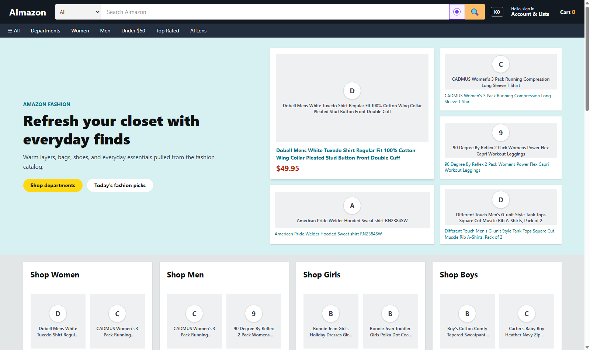
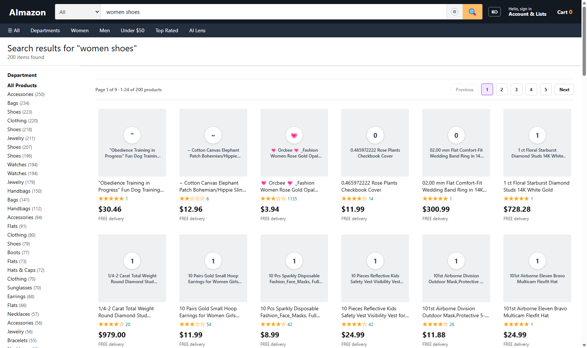
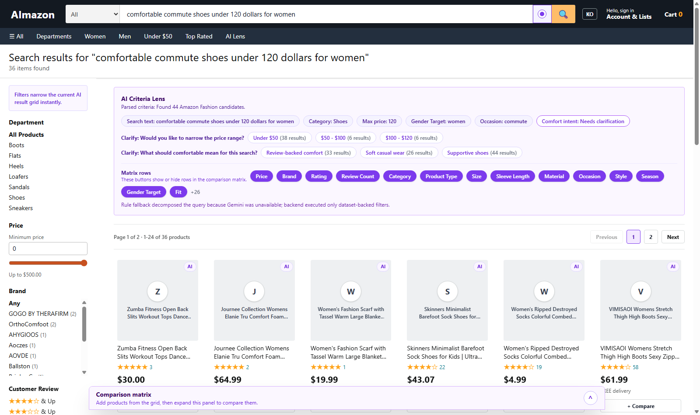
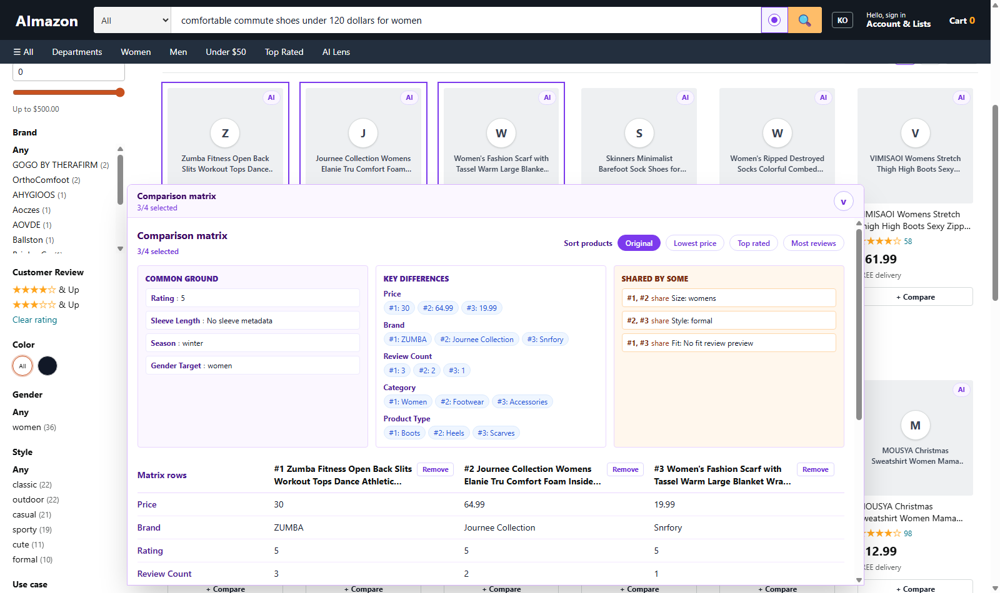
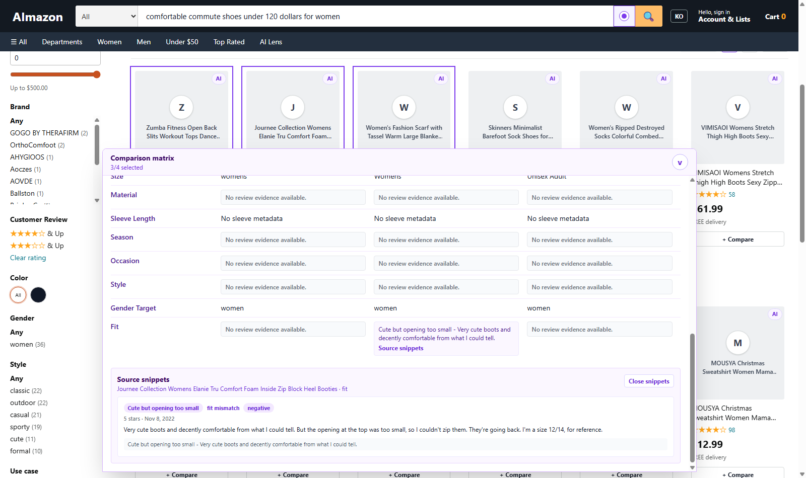
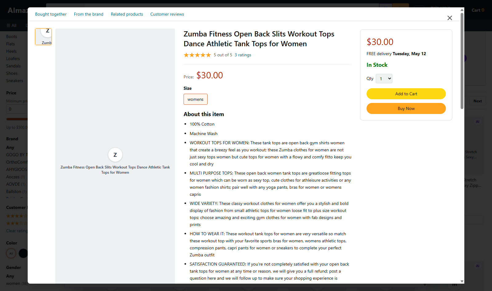
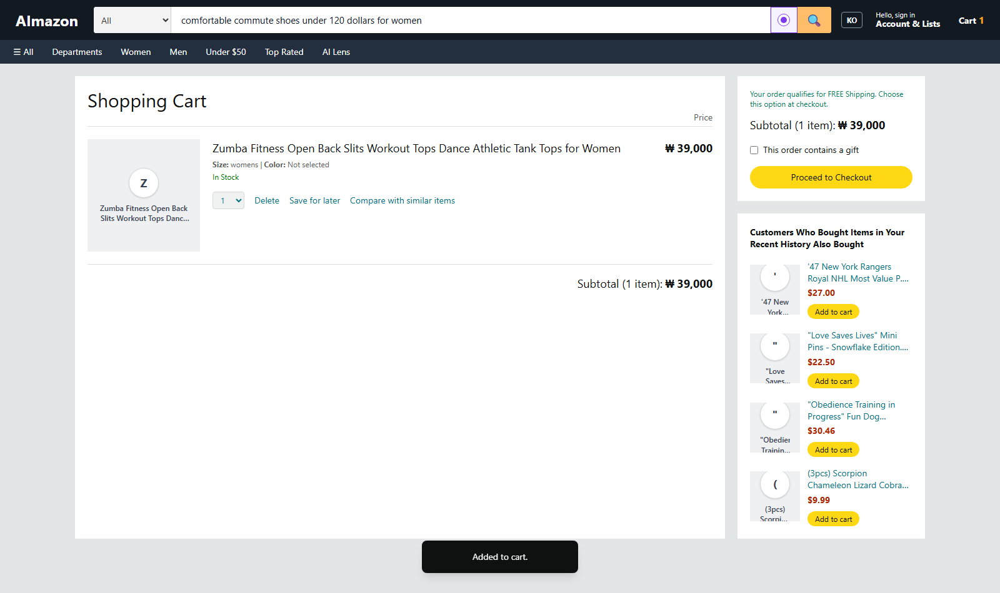
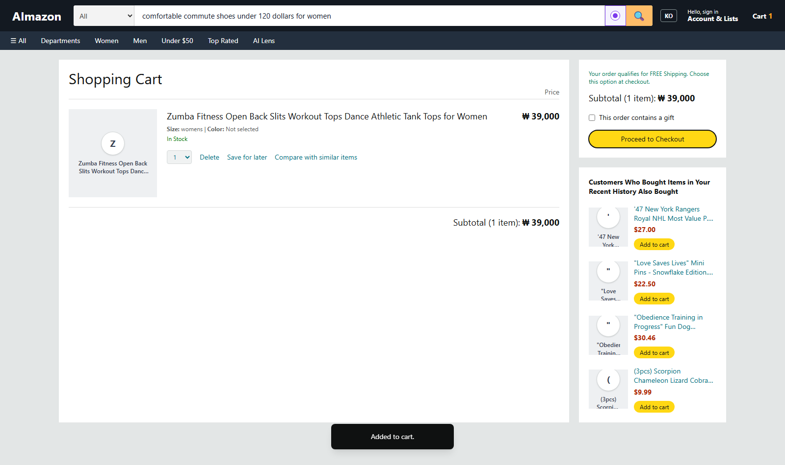

# HAI

Human-AI Interaction project for the AImazon shopping and product-comparison study.

The active implementation is an Amazon Fashion shopping prototype backed by the Amazon Reviews 2023 Fashion dataset in Supabase. The main user-facing goal is to let participants search, refine ambiguous natural-language criteria, compare products in place, inspect review evidence, add an item to cart, and reach the checkout handoff point without leaving the shopping flow.

## Current Feature Set

- Amazon-style home page with department navigation, search, account/cart affordances, and product shelves.
- Regular catalog search with persistent left-side filters.
- AI Criteria Lens search mode toggled from the search bar.
- Korean and English query support, with UI/product/review copy localized to the active language.
- Gemini-backed natural-language decomposition when `GEMINI_API_KEY` is available.
- Dataset-grounded parsed criteria, clarification chips, and result refresh through backend APIs.
- Product cards with compare selection.
- Bottom-docked comparison matrix with common ground, key differences, partial shared traits, sortable product columns, removable products, and review/source snippet expansion.
- Product detail modal with review section and Add to Cart.
- Cart page with item quantity, subtotal, recommendations, and a checkout button placeholder for the future Google Docs handoff.
- Study event logging through `POST /api/logs`.

## Run Locally

Start the backend:

```powershell
cd backend
pnpm install
Copy-Item .env.example .env
# Fill DATABASE_URL and optionally GEMINI_API_KEY in backend/.env.
pnpm run db:migrate
pnpm run db:verify:amazon2023
pnpm run dev
```

Start the frontend:

```powershell
cd frontend/Amazon
pnpm install
pnpm run dev
```

Open `http://127.0.0.1:8000`. The backend is expected at `http://127.0.0.1:8002`.

Useful verification commands:

```powershell
cd backend
pnpm run check
pnpm run build
pnpm run db:verify:amazon2023
pnpm run ai:qa:amazon2023

cd ..\frontend\Amazon
pnpm run build
pnpm run e2e:amazon2023
```

## Project Structure

```text
.
|-- README.md
|-- AGENTS.md
|-- docs/
|   |-- screenshots/
|   |-- PROJECT.md
|   |-- IMPLEMENTATION.md
|   |-- SERVICE_DATA_FLOW.md
|   |-- STUDY.md
|   `-- archive/
|-- frontend/
|   `-- Amazon/
|       |-- src/App.jsx
|       |-- src/data.js
|       |-- src/styles.css
|       `-- scripts/e2e-amazon2023-cdp.mjs
|-- backend/
|   |-- src/
|   |-- scripts/
|   |-- drizzle/
|   |-- api-docs/
|   |-- supabase/
|   `-- deployment/
`-- ai/
    |-- nl-request-agent/
    |-- display-agent/
    `-- shared/
```

## Important Files And Functions

Frontend:

- `frontend/Amazon/src/App.jsx`
  - `Header`: Amazon-style navigation, language toggle, AI toggle, search submit, cart access.
  - `ProductListing`: search results layout, AI Criteria Lens panel, filter sidebar, grid pagination, comparison dock.
  - `FilterSidebar`: left-side filter controls for regular and AI results.
  - `ProductCard`: product card rendering, matched criteria chips, compare button.
  - `ComparisonMatrix` and `ComparisonMatrixDock`: bottom matrix, common/different traits, sorting, remove actions, source snippets.
  - `DetailModal`: product detail, options, review list, Add to Cart.
  - `CartPage`: cart review and checkout handoff placeholder.
  - `handleSubmit`, `handleFilterChange`, `handleClarifyCriteria`, `handleAddToCart`: primary user-flow handlers.
- `frontend/Amazon/src/data.js`
  - `searchCatalogProducts`, `loadCatalogFacets`, `loadProductDetail`: catalog API clients.
  - `runAiQuery`, `compareAiProducts`, `loadAiEvidence`, `refineAiQuery`: AI Criteria Lens API clients.
  - `normalizeProduct`: backend payload normalization for UI rendering.

Backend:

- `backend/src/app.ts`: Express app setup and route mounting.
- `backend/src/db/schema.ts`: Drizzle schema for Amazon 2023 shopping tables and study logs.
- `backend/src/routes/amazon2023.ts`: catalog categories, products, facets, and detail endpoints.
- `backend/src/routes/amazon2023-ai.ts`: AI query, interpret, compare, evidence, and refine endpoints.
- `backend/src/repositories/amazon2023.ts`: SQL query builders, filters, facets, serialization, product details, semantic attributes.
- `backend/scripts/import-amazon-2023.ts`: Amazon Reviews 2023 importer.
- `backend/scripts/enrich-amazon-2023-semantics.ts`: compact product-level semantic enrichment.
- `backend/scripts/verify-amazon-2023-db.ts`: Supabase size and data-quality verifier.

AI:

- `ai/nl-request-agent/`: experimental natural-language request parser service.
- `ai/display-agent/`: experimental UI display payload service.
- `ai/shared/`: shared schema helpers used by the AI modules.

## UI Screenshots

The screenshots below were captured against local frontend `127.0.0.1:8000` and backend `127.0.0.1:8002` after waiting for visible images to finish loading or fail over to the product fallback thumbnail.

| Flow | Screenshot |
| --- | --- |
| Home |  |
| Regular search and filters |  |
| AI Criteria Lens |  |
| Comparison matrix |  |
| Review/source snippets |  |
| Product detail Add to Cart |  |
| Cart |  |
| Checkout button click |  |

## Branch Workflow

- `main`: stable branch.
- `dev`: active integration branch.
- Fixed role branches: `frontend`, `backend`, `ai-nl`, and `ai-display`.

See `docs/BRANCHING.md`.

## Documentation Map

- `frontend/Amazon/README.md`: frontend run guide, UI flows, screenshots, and component roles.
- `backend/README.md`: API server, Supabase, importer, verifier, and endpoint guide.
- `backend/api-docs/amazon2023-api.md`: Amazon Reviews 2023 API and data contract.
- `backend/api-docs/amazon-ai-api.md`: AI Criteria Lens API details.
- `backend/deployment/amazon2023-cutover-runbook.md`: dataset cutover and backup procedure.
- `docs/FREE_DEPLOYMENT.md`: Vercel frontend + Render backend free deployment guide.
- `docs/STUDY.md`: user-study plan and logging requirements.
