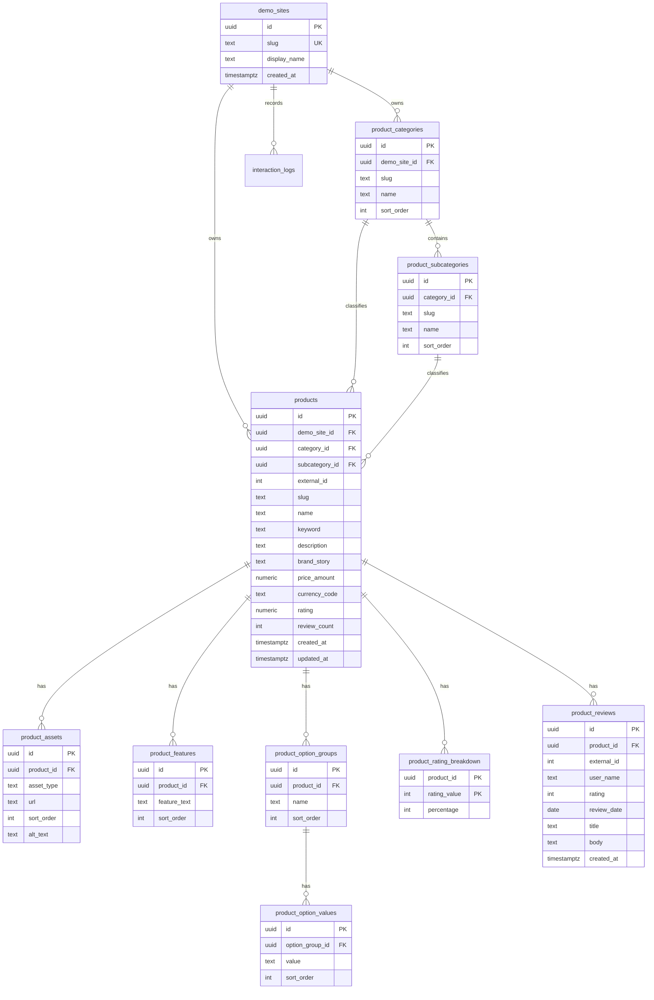

# Amazon Demo API

## Base Path

```text
/api/demos/amazon
```

## Design Scope

This API stores the Amazon shopping demo catalog in normalized Postgres tables and returns UI-ready product data for the frontend.

The current frontend data files are:

- `frontend/Amazon/products.json`
- `frontend/Amazon/review.json`

Reviews may be replaced later by the frontend team. The backend assumes the same review fields:

```text
id, productId, userName, rating, date, title, comment
```

AI-specific task and generated-evidence tables are intentionally not included yet. The schema keeps stable product and review identifiers so future AI agents can request, cite, and display evidence by product/review ID.

## Schema Diagram



## Column Descriptions

### `product_categories`

| Column | Type | Constraint | Description |
| --- | --- | --- | --- |
| `id` | uuid | primary key | Internal category identifier. |
| `demo_site_id` | uuid | references `demo_sites(id)`, not null | Demo site that owns this category. |
| `slug` | text | not null, unique with `demo_site_id` | Stable URL/API key, e.g. `outerwear`. |
| `name` | text | not null | Display category name from frontend data. |
| `sort_order` | integer | not null, default `0` | Home/sidebar display order. |

### `product_subcategories`

| Column | Type | Constraint | Description |
| --- | --- | --- | --- |
| `id` | uuid | primary key | Internal subcategory identifier. |
| `category_id` | uuid | references `product_categories(id)`, not null | Parent category. |
| `slug` | text | not null, unique with `category_id` | Stable subcategory key, e.g. `coats`. |
| `name` | text | not null | Display subcategory name from frontend data. |
| `sort_order` | integer | not null, default `0` | Sidebar display order inside a category. |

### `products`

| Column | Type | Constraint | Description |
| --- | --- | --- | --- |
| `id` | uuid | primary key | Internal product identifier used by backend and future AI references. |
| `demo_site_id` | uuid | references `demo_sites(id)`, not null | Demo site that owns this product. |
| `category_id` | uuid | references `product_categories(id)`, not null | Product's main category. |
| `subcategory_id` | uuid | references `product_subcategories(id)`, not null | Product's subcategory. |
| `external_id` | integer | not null, unique with `demo_site_id` | Stable ID from `products.json`; useful for frontend migration. |
| `slug` | text | not null, unique with `demo_site_id` | Human-readable API lookup key. |
| `name` | text | not null | Product display name. |
| `keyword` | text | nullable | Search seed keyword from mock data. |
| `description` | text | not null | Product summary/AI summary source text from `desc`. |
| `brand_story` | text | nullable | Brand story text. |
| `price_amount` | numeric(12,2) | not null, `>= 0` | Exact product price. |
| `currency_code` | text | not null, default `USD` | Currency for `price_amount`. |
| `rating` | numeric(2,1) | not null, `0..5` | Average product rating. |
| `review_count` | integer | not null, `>= 0` | Denormalized display count from mock data. |
| `created_at` | timestamptz | not null | Insert timestamp. |
| `updated_at` | timestamptz | not null | Last update timestamp. |

### `product_assets`

| Column | Type | Constraint | Description |
| --- | --- | --- | --- |
| `id` | uuid | primary key | Internal asset identifier. |
| `product_id` | uuid | references `products(id)`, not null | Product that owns this asset. |
| `asset_type` | text | not null | Asset role: `primary`, `description`, or `brand`. |
| `url` | text | not null | Image URL. |
| `sort_order` | integer | not null, default `0` | Ordered display position within the asset type. |
| `alt_text` | text | nullable | Accessibility label for the image. |

### `product_features`

| Column | Type | Constraint | Description |
| --- | --- | --- | --- |
| `id` | uuid | primary key | Internal feature identifier. |
| `product_id` | uuid | references `products(id)`, not null | Product that owns this feature. |
| `feature_text` | text | not null | One feature bullet. |
| `sort_order` | integer | not null, default `0` | Feature bullet order. |

### `product_option_groups`

| Column | Type | Constraint | Description |
| --- | --- | --- | --- |
| `id` | uuid | primary key | Internal option group identifier. |
| `product_id` | uuid | references `products(id)`, not null | Product that owns this option group. |
| `name` | text | not null | Option group name, currently `size` or `color`. |
| `sort_order` | integer | not null, default `0` | Option group display order. |

### `product_option_values`

| Column | Type | Constraint | Description |
| --- | --- | --- | --- |
| `id` | uuid | primary key | Internal option value identifier. |
| `option_group_id` | uuid | references `product_option_groups(id)`, not null | Parent option group. |
| `value` | text | not null | Display value such as `M`, `Black`, or `Camel`. |
| `sort_order` | integer | not null, default `0` | Option value display order. |

### `product_rating_breakdown`

| Column | Type | Constraint | Description |
| --- | --- | --- | --- |
| `product_id` | uuid | primary key, references `products(id)` | Product that owns this rating row. |
| `rating_value` | integer | primary key, `1..5` | Star rating bucket. |
| `percentage` | integer | not null, `0..100` | Percent shown in the rating bar. |

### `product_reviews`

| Column | Type | Constraint | Description |
| --- | --- | --- | --- |
| `id` | uuid | primary key | Internal review identifier used by future evidence citations. |
| `product_id` | uuid | references `products(id)`, not null | Product being reviewed. |
| `external_id` | integer | not null, unique with `product_id` | Stable ID from `review.json`. |
| `user_name` | text | not null | Review author display name. |
| `rating` | integer | not null, `1..5` | Review star rating. |
| `review_date` | date | not null | Review date. |
| `title` | text | not null | Review title. |
| `body` | text | not null | Review text. |
| `created_at` | timestamptz | not null | Insert timestamp. |

## Indexes

```sql
create unique index uq_product_categories_demo_slug
on product_categories (demo_site_id, slug);

create index idx_product_categories_demo_order
on product_categories (demo_site_id, sort_order);

create unique index uq_product_subcategories_category_slug
on product_subcategories (category_id, slug);

create index idx_product_subcategories_category_order
on product_subcategories (category_id, sort_order);

create unique index uq_products_demo_external_id
on products (demo_site_id, external_id);

create unique index uq_products_demo_slug
on products (demo_site_id, slug);

create index idx_products_demo_category_external
on products (demo_site_id, category_id, external_id);

create index idx_products_demo_subcategory_external
on products (demo_site_id, subcategory_id, external_id);

create index idx_product_assets_product_type_order
on product_assets (product_id, asset_type, sort_order);

create index idx_product_reviews_product_date
on product_reviews (product_id, review_date);
```

These indexes target the current frontend paths:

- category home rendering
- category/subcategory filtering
- cursor pagination by `external_id`
- product detail asset/feature/option/review loading
- future AI retrieval by stable product/review references

## Response Models

### Product Summary

```json
{
  "id": "uuid",
  "externalId": 1,
  "slug": "cashmere-coat-1",
  "name": "프리미엄 캐시미어 블렌드 오버핏 코트",
  "keyword": "cashmere coat",
  "description": "이탈리아산 최고급 캐시미어...",
  "brandStory": "클래식한 아름다움...",
  "price": {
    "amount": 299,
    "currencyCode": "USD"
  },
  "rating": 4.9,
  "reviewCount": 1240,
  "category": {
    "id": "uuid",
    "slug": "outerwear",
    "name": "Outerwear"
  },
  "subCategory": {
    "id": "uuid",
    "slug": "coats",
    "name": "Coats"
  },
  "assets": [
    {
      "type": "primary",
      "url": "https://...",
      "altText": "..."
    }
  ]
}
```

### Product Detail

Product detail extends Product Summary:

```json
{
  "...": "product summary fields",
  "features": [
    {
      "id": "uuid",
      "text": "최고급 원사 블렌딩..."
    }
  ],
  "options": [
    {
      "id": "uuid",
      "name": "size",
      "values": ["S", "M", "L", "XL"]
    }
  ],
  "ratingBreakdown": [
    {
      "ratingValue": 5,
      "percentage": 90
    }
  ],
  "reviews": [
    {
      "id": "uuid",
      "externalId": 1,
      "userName": "reviewer",
      "rating": 5,
      "date": "2026-01-01",
      "title": "review title",
      "comment": "review text"
    }
  ],
  "relatedProducts": []
}
```

## Endpoints

## `GET /api/demos/amazon/home`

Returns all data required for the Amazon demo home/category entry screen. The response includes ordered categories, subcategories, product counts, and a representative product image for each category card.

```text
GET /api/demos/amazon/home
```

Example response:

```json
{
  "demo": "amazon",
  "categories": [
    {
      "id": "uuid",
      "slug": "outerwear",
      "name": "Outerwear",
      "productCount": 25,
      "representativeProduct": {
        "id": "uuid",
        "externalId": 1,
        "name": "프리미엄 캐시미어 블렌드 오버핏 코트",
        "assets": []
      },
      "subCategories": [
        {
          "id": "uuid",
          "slug": "coats",
          "name": "Coats"
        }
      ]
    }
  ]
}
```

## `GET /api/demos/amazon/categories`

Returns category and subcategory metadata only. Use this for search dropdowns, sidebars, and filters.

```text
GET /api/demos/amazon/categories
```

## `GET /api/demos/amazon/products`

Returns product summaries for search and category/subcategory listing pages. This endpoint uses cursor pagination with `external_id`.

```text
GET /api/demos/amazon/products?query=coat&category=outerwear&subCategory=coats&limit=24&cursor=24
```

Query parameters:

| Name | Type | Required | Description |
| --- | --- | --- | --- |
| `query` | text | no | Case-insensitive search over `name`, `keyword`, and `description`. |
| `category` | text | no | Category slug. |
| `subCategory` | text | no | Subcategory slug. |
| `limit` | integer | no | Max products to return. Default `24`, max `100`. |
| `cursor` | integer | no | Last seen `externalId`; next page returns products after this value. |

Example response:

```json
{
  "demo": "amazon",
  "items": [],
  "pagination": {
    "limit": 24,
    "nextCursor": 24,
    "total": 70
  }
}
```

## `GET /api/demos/amazon/products/{productId}`

Returns full product detail data for one product. `productId` can be the internal UUID, the slug, or the numeric `externalId` from `products.json`.

```text
GET /api/demos/amazon/products/1
GET /api/demos/amazon/products/cashmere-coat-1
```

Use this when a user opens a product detail modal. The response includes product assets, feature bullets, option groups, rating breakdown, reviews, and related products.

## `POST /api/logs`

Stores study/interaction logs. This endpoint is shared with the Netflix demo.

For Amazon, use:

```json
{
  "demo": "amazon",
  "sessionId": "session_001",
  "participantId": "p001",
  "eventType": "product_opened",
  "payload": {
    "productId": "uuid",
    "externalId": 1
  }
}
```

## Error Model

```json
{
  "error": {
    "code": "PRODUCT_NOT_FOUND",
    "message": "Product not found."
  }
}
```

Common codes:

- `DEMO_NOT_FOUND`
- `PRODUCT_NOT_FOUND`
- `INVALID_REQUEST`
- `NOT_FOUND`
- `INTERNAL_ERROR`

## AI Feature Notes

The current schema supports future AI features without adding AI-specific tables yet:

- Natural-language selection can refer to `products.id`, `externalId`, category slugs, and visible product order.
- Evidence display can cite `product_reviews.id` and `product_reviews.external_id`.
- Review snippets can later be topic-tagged in a separate table, e.g. `product_review_topics`, after the AI engineer finalizes topic extraction fields.
- AI-generated summaries should not overwrite `products.description`; store generated outputs separately once the AI display contract is stable.
