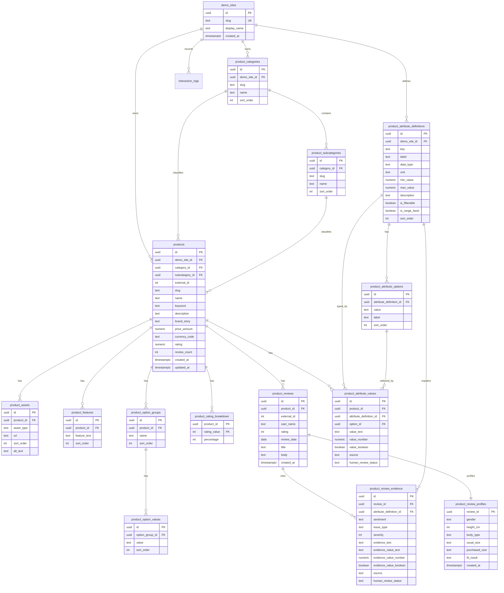

# Amazon Demo API

## Base Path

```text
/api/demos/amazon
```

## Design Scope

This API stores the Amazon shopping demo catalog in normalized Postgres tables and returns UI-ready product data for the frontend.

The current backend seed fixture files are:

- `backend/fixtures/amazon-human/attribute_taxonomy.json`
- `backend/fixtures/amazon-human/batches/batch-*.json`
- `backend/fixtures/amazon-human/PROGRESS.md`

The current fixture is a batch-authored dataset. The previous mechanical 400-product/10,000-review generated fixture was removed. As of the current progress log, Supabase contains only the completed human-authored batches.

Reviews may be replaced later by the frontend team. The backend assumes the same base review fields:

```text
id, productId, userName, rating, date, title, comment
```

AI-specific task tables are intentionally not included yet. The catalog includes AI-ready product attributes, review profiles, and issue-tagged review evidence so the NL request agent can translate natural-language requests into objective API filters while the backend returns evidence summaries for display.

## Schema Diagram



## Column Descriptions

### `product_categories`

| Column | Type | Constraint | Description |
| --- | --- | --- | --- |
| `id` | uuid | primary key | Internal category identifier. |
| `demo_site_id` | uuid | references `demo_sites(id)`, not null | Demo site that owns this category. |
| `slug` | text | not null, unique with `demo_site_id` | Stable URL/API key, e.g. `outerwear`. |
| `name` | text | not null | Display category name from frontend data. |
| `sort_order` | integer | not null, default `0` | Home/sidebar display order. |

### `product_subcategories`

| Column | Type | Constraint | Description |
| --- | --- | --- | --- |
| `id` | uuid | primary key | Internal subcategory identifier. |
| `category_id` | uuid | references `product_categories(id)`, not null | Parent category. |
| `slug` | text | not null, unique with `category_id` | Stable subcategory key, e.g. `coats`. |
| `name` | text | not null | Display subcategory name from frontend data. |
| `sort_order` | integer | not null, default `0` | Sidebar display order inside a category. |

### `products`

| Column | Type | Constraint | Description |
| --- | --- | --- | --- |
| `id` | uuid | primary key | Internal product identifier used by backend and future AI references. |
| `demo_site_id` | uuid | references `demo_sites(id)`, not null | Demo site that owns this product. |
| `category_id` | uuid | references `product_categories(id)`, not null | Product's main category. |
| `subcategory_id` | uuid | references `product_subcategories(id)`, not null | Product's subcategory. |
| `external_id` | integer | not null, unique with `demo_site_id` | Stable ID from fixture `products.json`; useful for frontend migration. |
| `slug` | text | not null, unique with `demo_site_id` | Human-readable API lookup key. |
| `name` | text | not null | Product display name. |
| `keyword` | text | nullable | Search seed keyword from mock data. |
| `description` | text | not null | Product summary/AI summary source text from `desc`. |
| `brand_story` | text | nullable | Brand story text. |
| `price_amount` | numeric(12,2) | not null, `>= 0` | Exact product price. |
| `currency_code` | text | not null, default `USD` | Currency for `price_amount`. |
| `rating` | numeric(2,1) | not null, `0..5` | Average product rating. |
| `review_count` | integer | not null, `>= 0` | Denormalized display count from mock data. |
| `created_at` | timestamptz | not null | Insert timestamp. |
| `updated_at` | timestamptz | not null | Last update timestamp. |

### `product_assets`

| Column | Type | Constraint | Description |
| --- | --- | --- | --- |
| `id` | uuid | primary key | Internal asset identifier. |
| `product_id` | uuid | references `products(id)`, not null | Product that owns this asset. |
| `asset_type` | text | not null | Asset role: `primary`, `description`, or `brand`. |
| `url` | text | not null | Image URL. |
| `sort_order` | integer | not null, default `0` | Ordered display position within the asset type. |
| `alt_text` | text | nullable | Accessibility label for the image. |

### `product_features`

| Column | Type | Constraint | Description |
| --- | --- | --- | --- |
| `id` | uuid | primary key | Internal feature identifier. |
| `product_id` | uuid | references `products(id)`, not null | Product that owns this feature. |
| `feature_text` | text | not null | One feature bullet. |
| `sort_order` | integer | not null, default `0` | Feature bullet order. |

### `product_option_groups`

| Column | Type | Constraint | Description |
| --- | --- | --- | --- |
| `id` | uuid | primary key | Internal option group identifier. |
| `product_id` | uuid | references `products(id)`, not null | Product that owns this option group. |
| `name` | text | not null | Option group name, currently `size` or `color`. |
| `sort_order` | integer | not null, default `0` | Option group display order. |

### `product_option_values`

| Column | Type | Constraint | Description |
| --- | --- | --- | --- |
| `id` | uuid | primary key | Internal option value identifier. |
| `option_group_id` | uuid | references `product_option_groups(id)`, not null | Parent option group. |
| `value` | text | not null | Display value such as `M`, `Black`, or `Camel`. |
| `sort_order` | integer | not null, default `0` | Option value display order. |

### `product_rating_breakdown`

| Column | Type | Constraint | Description |
| --- | --- | --- | --- |
| `product_id` | uuid | primary key, references `products(id)` | Product that owns this rating row. |
| `rating_value` | integer | primary key, `1..5` | Star rating bucket. |
| `percentage` | integer | not null, `0..100` | Percent shown in the rating bar. |

### `product_reviews`

| Column | Type | Constraint | Description |
| --- | --- | --- | --- |
| `id` | uuid | primary key | Internal review identifier used by future evidence citations. |
| `product_id` | uuid | references `products(id)`, not null | Product being reviewed. |
| `external_id` | integer | not null, unique with `product_id` | Stable ID from fixture `review.json`. |
| `user_name` | text | not null | Review author display name. |
| `rating` | integer | not null, `1..5` | Review star rating. |
| `review_date` | date | not null | Review date. |
| `title` | text | not null | Review title. |
| `body` | text | not null | Review text. |
| `created_at` | timestamptz | not null | Insert timestamp. |

### `product_review_profiles`

| Column | Type | Constraint | Description |
| --- | --- | --- | --- |
| `review_id` | uuid | primary key, references `product_reviews(id)` | Review that owns this reviewer profile. |
| `gender` | text | not null | Synthetic reviewer gender: `female`, `male`, `nonbinary`, or `prefer_not_to_say`. |
| `height_cm` | integer | not null | Synthetic reviewer height used for fit/body summaries. |
| `body_type` | text | not null | Synthetic body profile such as `petite`, `average`, `curvy`, `broad_shoulders`, or `plus`. |
| `usual_size` | text | not null | Reviewer usual size. |
| `purchased_size` | text | not null | Size selected for this product. |
| `fit_result` | text | not null | Fit result such as `true_to_size`, `slightly_small`, or `varies_by_body_type`. |
| `created_at` | timestamptz | not null | Insert timestamp. |

### `product_attribute_definitions`

| Column | Type | Constraint | Description |
| --- | --- | --- | --- |
| `id` | uuid | primary key | Internal attribute definition identifier. |
| `demo_site_id` | uuid | references `demo_sites(id)`, not null | Demo site that owns the attribute taxonomy. |
| `key` | text | not null, unique with `demo_site_id` | API/filter key such as `warmthLevel` or `waterproof`. |
| `label` | text | not null | Human-readable label for display. |
| `data_type` | text | not null | One of `text`, `number`, `boolean`, or `enum`. |
| `unit` | text | nullable | Unit for numeric values, e.g. `g` or `level`. |
| `min_value` | numeric(12,2) | nullable | Minimum allowed numeric value. |
| `max_value` | numeric(12,2) | nullable | Maximum allowed numeric value. |
| `description` | text | not null | Human-aligned meaning of the attribute for AI use. |
| `is_filterable` | boolean | not null | Whether the attribute can be used by product filters. |
| `is_range_facet` | boolean | not null | Whether numeric range summaries should be returned in facets. |
| `sort_order` | integer | not null | Stable attribute display order. |
| `created_at` | timestamptz | not null | Insert timestamp. |

### `product_attribute_options`

| Column | Type | Constraint | Description |
| --- | --- | --- | --- |
| `id` | uuid | primary key | Internal option identifier. |
| `attribute_definition_id` | uuid | references `product_attribute_definitions(id)`, not null | Enum attribute that owns this option. |
| `value` | text | not null, unique with `attribute_definition_id` | Stable enum value such as `wool_blend`. |
| `label` | text | not null | Display label such as `Wool Blend`. |
| `sort_order` | integer | not null | Option display order. |

### `product_attribute_values`

| Column | Type | Constraint | Description |
| --- | --- | --- | --- |
| `id` | uuid | primary key | Internal product attribute value identifier. |
| `product_id` | uuid | references `products(id)`, not null | Product that owns this attribute value. |
| `attribute_definition_id` | uuid | references `product_attribute_definitions(id)`, not null | Attribute definition for this value. |
| `option_id` | uuid | references `product_attribute_options(id)`, nullable | Enum option value when `data_type=enum`. |
| `value_text` | text | nullable | Text value when `data_type=text`. |
| `value_number` | numeric(12,2) | nullable | Numeric value when `data_type=number`. |
| `value_boolean` | boolean | nullable | Boolean value when `data_type=boolean`. |
| `source` | text | not null | Source label, currently `generated`. |
| `human_review_status` | text | not null | `generated`, `reviewed`, or `approved`. |
| `created_at` | timestamptz | not null | Insert timestamp. |

### `product_review_evidence`

| Column | Type | Constraint | Description |
| --- | --- | --- | --- |
| `id` | uuid | primary key | Internal evidence row identifier. |
| `review_id` | uuid | references `product_reviews(id)`, not null | Review that contains the evidence. |
| `attribute_definition_id` | uuid | references `product_attribute_definitions(id)`, not null | Attribute supported by this review snippet. |
| `sentiment` | text | not null | `positive`, `neutral`, or `negative`. |
| `issue_type` | text | not null | Structured issue key for negative evidence, or `none`. |
| `severity` | integer | not null | Issue severity from `0` to `5`; positive evidence uses `0`. |
| `evidence_text` | text | not null | Short snippet grounded in the review text. |
| `evidence_value_text` | text | nullable | Optional text/enum value associated with the evidence. |
| `evidence_value_number` | numeric(12,2) | nullable | Optional numeric value associated with the evidence. |
| `evidence_value_boolean` | boolean | nullable | Optional boolean value associated with the evidence. |
| `source` | text | not null | Source label, currently `generated`. |
| `human_review_status` | text | not null | `generated`, `reviewed`, or `approved`. |
| `created_at` | timestamptz | not null | Insert timestamp. |

## Indexes

```sql
create unique index uq_product_categories_demo_slug
on product_categories (demo_site_id, slug);

create index idx_product_categories_demo_order
on product_categories (demo_site_id, sort_order);

create unique index uq_product_subcategories_category_slug
on product_subcategories (category_id, slug);

create index idx_product_subcategories_category_order
on product_subcategories (category_id, sort_order);

create unique index uq_products_demo_external_id
on products (demo_site_id, external_id);

create unique index uq_products_demo_slug
on products (demo_site_id, slug);

create index idx_products_demo_category_external
on products (demo_site_id, category_id, external_id);

create index idx_products_demo_subcategory_external
on products (demo_site_id, subcategory_id, external_id);

create index idx_product_assets_product_type_order
on product_assets (product_id, asset_type, sort_order);

create index idx_product_reviews_product_date
on product_reviews (product_id, review_date);

create index idx_products_demo_price_external
on products (demo_site_id, price_amount, external_id);

create index idx_products_demo_rating_external
on products (demo_site_id, rating desc, external_id);

create index idx_products_demo_review_count_external
on products (demo_site_id, review_count desc, external_id);

create unique index uq_product_attribute_definitions_demo_key
on product_attribute_definitions (demo_site_id, key);

create unique index uq_product_attribute_options_definition_value
on product_attribute_options (attribute_definition_id, value);

create unique index uq_product_attribute_values_product_definition
on product_attribute_values (product_id, attribute_definition_id);

create index idx_product_attribute_values_definition_number
on product_attribute_values (attribute_definition_id, value_number);

create index idx_product_attribute_values_definition_boolean
on product_attribute_values (attribute_definition_id, value_boolean);

create index idx_product_attribute_values_definition_option
on product_attribute_values (attribute_definition_id, option_id);

create index idx_product_review_evidence_review
on product_review_evidence (review_id);

create index idx_product_review_profiles_fit_result
on product_review_profiles (fit_result);

create index idx_product_review_profiles_gender_height_body
on product_review_profiles (gender, height_cm, body_type);

create index idx_product_review_evidence_issue_sentiment_severity
on product_review_evidence (issue_type, sentiment, severity);

create index idx_product_review_evidence_attribute_issue
on product_review_evidence (attribute_definition_id, issue_type);
```

These indexes target the current frontend paths:

- category home rendering
- category/subcategory filtering
- cursor pagination by `external_id`
- AI range filtering by price, rating, and review count
- AI attribute filtering by numeric, boolean, and enum attribute values
- review profile and issue evidence loading for grounded display summaries
- product detail asset/feature/option/review loading
- future AI retrieval by stable product/review references

## Response Models

### Product Summary

```json
{
  "id": "uuid",
  "externalId": 1,
  "slug": "cashmere-coat-1",
  "name": "프리미엄 캐시미어 블렌드 오버핏 코트",
  "keyword": "cashmere coat",
  "description": "이탈리아산 최고급 캐시미어...",
  "brandStory": "클래식한 아름다움...",
  "price": {
    "amount": 299,
    "currencyCode": "USD"
  },
  "rating": 4.9,
  "reviewCount": 1240,
  "category": {
    "id": "uuid",
    "slug": "outerwear",
    "name": "Outerwear"
  },
  "subCategory": {
    "id": "uuid",
    "slug": "coats",
    "name": "Coats"
  },
  "assets": [
    {
      "type": "primary",
      "url": "https://...",
      "altText": "..."
    }
  ]
}
```

### Product Detail

Product detail extends Product Summary:

```json
{
  "...": "product summary fields",
  "features": [
    {
      "id": "uuid",
      "text": "최고급 원사 블렌딩..."
    }
  ],
  "options": [
    {
      "id": "uuid",
      "name": "size",
      "values": ["S", "M", "L", "XL"]
    }
  ],
  "ratingBreakdown": [
    {
      "ratingValue": 5,
      "percentage": 90
    }
  ],
  "reviews": [
    {
      "id": "uuid",
      "externalId": 1,
      "userName": "reviewer",
      "rating": 5,
      "date": "2026-01-01",
      "title": "review title",
      "comment": "review text"
    }
  ],
  "relatedProducts": []
}
```

## Endpoints

## `GET /api/demos/amazon/home`

Returns all data required for the Amazon demo home/category entry screen. The response includes ordered categories, subcategories, product counts, and a representative product image for each category card.

```text
GET /api/demos/amazon/home
```

Example response:

```json
{
  "demo": "amazon",
  "categories": [
    {
      "id": "uuid",
      "slug": "outerwear",
      "name": "Outerwear",
      "productCount": 25,
      "representativeProduct": {
        "id": "uuid",
        "externalId": 1,
        "name": "프리미엄 캐시미어 블렌드 오버핏 코트",
        "assets": []
      },
      "subCategories": [
        {
          "id": "uuid",
          "slug": "coats",
          "name": "Coats"
        }
      ]
    }
  ]
}
```

## `GET /api/demos/amazon/categories`

Returns category and subcategory metadata only. Use this for search dropdowns, sidebars, and filters.

```text
GET /api/demos/amazon/categories
```

## `GET /api/demos/amazon/products`

Returns product summaries for search, category/subcategory listing pages, and AI-generated range filters. The default sort uses cursor pagination with `external_id`.

```text
GET /api/demos/amazon/products?query=coat&category=outerwear&subCategory=coats&priceMax=120&ratingMin=4.3&attribute.warmthLevelMin=4&attribute.waterproof=true&sort=rating_desc&limit=24
```

Query parameters:

| Name | Type | Required | Description |
| --- | --- | --- | --- |
| `query` | text | no | Case-insensitive search over `name`, `keyword`, and `description`. |
| `category` | text | no | Category slug. |
| `subCategory` | text | no | Subcategory slug. |
| `priceMin` | number | no | Minimum product price. Must be `>= 0`. |
| `priceMax` | number | no | Maximum product price. Must be `>= 0`. |
| `ratingMin` | number | no | Minimum average product rating. Must be between `0` and `5`. |
| `ratingMax` | number | no | Maximum average product rating. Must be between `0` and `5`. |
| `reviewCountMin` | integer | no | Minimum denormalized product review count. Must be `>= 0`. |
| `reviewCountMax` | integer | no | Maximum denormalized product review count. Must be `>= 0`. |
| `attribute.{key}` | string, number, boolean | no | Exact attribute filter. Examples: `attribute.material=wool_blend`, `attribute.waterproof=true`. |
| `attribute.{key}Min` | number | no | Minimum numeric attribute filter. Example: `attribute.warmthLevelMin=4`. |
| `attribute.{key}Max` | number | no | Maximum numeric attribute filter. Example: `attribute.weightGramsMax=900`. |
| `sort` | enum | no | One of `external_id_asc`, `price_asc`, `price_desc`, `rating_desc`, `review_count_desc`. Default `external_id_asc`. |
| `limit` | integer | no | Max products to return. Default `24`, max `100`. |
| `cursor` | integer | no | Last seen `externalId`; next page returns products after this value. Currently supported only with `sort=external_id_asc`. |

AI use:

- Use this endpoint after the NL request agent resolves a user phrase into explicit filters.
- Range-like phrases must be converted into numeric parameters before this endpoint is called.
- Example: `not too expensive` may become `priceMax=120`; `good reviews` may become `ratingMin=4.3&reviewCountMin=50`.
- Attribute phrases should use the taxonomy keys. Example: `warm` may become `attribute.warmthLevelMin=4`; `waterproof bag` may become `category=bags&attribute.waterproof=true`.

Example response:

```json
{
  "demo": "amazon",
  "items": [],
  "sort": "rating_desc",
  "pagination": {
    "limit": 24,
    "nextCursor": null,
    "total": 6
  }
}
```

## `GET /api/demos/amazon/products/facets`

Returns numeric range summaries, attribute facets, and review intelligence summaries for the current candidate set. Use this before applying subjective range phrases so the NL request agent can make objective, data-grounded interpretations and the display agent can expose common tradeoffs.

```text
GET /api/demos/amazon/products/facets?query=coat&category=outerwear
```

Supported query parameters:

| Name | Type | Required | Description |
| --- | --- | --- | --- |
| `query` | text | no | Same search query used by the products endpoint. |
| `category` | text | no | Category slug. |
| `subCategory` | text | no | Subcategory slug. |
| `priceMin` | number | no | Optional minimum price if the current candidate set is already narrowed. |
| `priceMax` | number | no | Optional maximum price if the current candidate set is already narrowed. |
| `ratingMin` | number | no | Optional minimum rating. |
| `ratingMax` | number | no | Optional maximum rating. |
| `reviewCountMin` | integer | no | Optional minimum review count. |
| `reviewCountMax` | integer | no | Optional maximum review count. |
| `attribute.{key}` | string, number, boolean | no | Optional exact attribute filter applied to the candidate set. |
| `attribute.{key}Min` | number | no | Optional minimum numeric attribute filter. |
| `attribute.{key}Max` | number | no | Optional maximum numeric attribute filter. |

Example response:

```json
{
  "demo": "amazon",
  "total": 25,
  "ranges": {
    "price": {
      "min": 49.99,
      "max": 299.99,
      "average": 126.45,
      "median": 119.99,
      "p40": 99.99,
      "currencyCode": "USD"
    },
    "rating": {
      "min": 3.8,
      "max": 5,
      "average": 4.52,
      "median": 4.5,
      "p70": 4.7
    },
    "reviewCount": {
      "min": 12,
      "max": 1240,
      "average": 212.6,
      "median": 180,
      "p70": 350
    }
  },
  "attributes": {
    "warmthLevel": {
      "key": "warmthLevel",
      "label": "Warmth Level",
      "dataType": "number",
      "unit": "level",
      "min": 1,
      "max": 5,
      "average": 3.42,
      "median": 4,
      "p40": 3,
      "p70": 4
    },
    "material": {
      "key": "material",
      "label": "Material",
      "dataType": "enum",
      "values": [
        {
          "value": "wool_blend",
          "label": "Wool Blend",
          "count": 8
        }
      ]
    },
    "waterproof": {
      "key": "waterproof",
      "label": "Waterproof",
      "dataType": "boolean",
      "values": [
        {
          "value": true,
          "label": "true",
          "count": 13
        }
      ]
    }
  },
  "reviewIntelligence": {
    "negativeIssues": [
      {
        "issueType": "uncomfortable_fit",
        "count": 42,
        "averageSeverity": 3.64,
        "affectedProducts": 18
      }
    ],
    "negativeAttributes": [
      {
        "attributeKey": "comfortLevel",
        "attributeLabel": "Comfort Level",
        "count": 38,
        "averageSeverity": 3.5,
        "affectedProducts": 17
      }
    ],
    "reviewerProfiles": {
      "fitResults": [
        {
          "fitResult": "true_to_size",
          "count": 210
        }
      ],
      "bodyTypes": [
        {
          "bodyType": "average",
          "count": 90
        }
      ],
      "genders": [
        {
          "gender": "female",
          "count": 120
        }
      ]
    }
  },
  "interpretationBasis": {
    "notTooExpensive": {
      "field": "price.amount",
      "operator": "<=",
      "value": 99.99,
      "basis": "40th percentile of matched products"
    },
    "goodReviews": {
      "rating": {
        "field": "rating",
        "operator": ">=",
        "value": 4.7,
        "basis": "70th percentile of matched products"
      },
      "reviewCount": {
        "field": "reviewCount",
        "operator": ">=",
        "value": 350,
        "basis": "70th percentile of matched products"
      }
    }
  }
}
```

AI use:

- Use this endpoint to ground range-like natural language in the current product set.
- The AI display should expose the resolved rule to the user, for example: `not too expensive = price <= 99.99, based on the lower 40% of matching products`.
- The backend returns numeric, attribute, negative issue, and reviewer-profile summaries; it does not decide the user's final priority.
- The NL request agent should not pre-read evidence. It should request candidate sets and evidence summaries from this endpoint.

## `GET /api/demos/amazon/products/{productId}`

Returns full product detail data for one product. `productId` can be the internal UUID, the slug, or the numeric `externalId` from fixture `products.json`.

```text
GET /api/demos/amazon/products/1
GET /api/demos/amazon/products/cashmere-coat-1
```

Use this when a user opens a product detail modal. The response includes product assets, feature bullets, option groups, rating breakdown, reviews, AI-ready attributes, review evidence, and related products.

Relevant response fields:

```json
{
  "reviews": [
    {
      "id": "uuid",
      "externalId": 1,
      "userName": "Minji",
      "rating": 3,
      "date": "2025-02-10",
      "title": "장단점이 확실해서 조건을 봐야 합니다",
      "comment": "review text",
      "profile": {
        "gender": "female",
        "heightCm": 170,
        "bodyType": "average",
        "usualSize": "M",
        "purchasedSize": "M",
        "fitResult": "true_to_size"
      }
    }
  ],
  "attributes": [
    {
      "key": "warmthLevel",
      "label": "Warmth Level",
      "dataType": "number",
      "unit": "level",
      "value": 5,
      "displayValue": 5,
      "source": "generated",
      "humanReviewStatus": "generated"
    }
  ],
  "reviewEvidence": [
    {
      "reviewId": "uuid",
      "reviewExternalId": 1,
      "attributeKey": "warmthLevel",
      "attributeLabel": "Warmth Level",
      "sentiment": "positive",
      "issueType": "none",
      "severity": 0,
      "evidenceText": "보온감은 5/5 수준이라 계절 선택 기준을 세우기 쉽습니다",
      "evidenceValue": 5,
      "source": "generated",
      "humanReviewStatus": "generated"
    }
  ]
}
```

## `POST /api/logs`

Stores study/interaction logs. This endpoint is shared with the Netflix demo.

For Amazon, use:

```json
{
  "demo": "amazon",
  "sessionId": "session_001",
  "participantId": "p001",
  "eventType": "product_opened",
  "payload": {
    "productId": "uuid",
    "externalId": 1
  }
}
```

## Error Model

```json
{
  "error": {
    "code": "PRODUCT_NOT_FOUND",
    "message": "Product not found."
  }
}
```

Common codes:

- `DEMO_NOT_FOUND`
- `PRODUCT_NOT_FOUND`
- `INVALID_REQUEST`
- `NOT_FOUND`
- `INTERNAL_ERROR`

## AI Feature Notes

The current schema supports API-grounded AI product selection without RAG/vector search:

- Natural-language selection can refer to `products.id`, `externalId`, category slugs, and visible product order.
- Evidence display can cite `product_reviews.id` and `product_reviews.external_id`.
- The NL request agent should translate user language into structured product filters and requested evidence types; it should not scan all review evidence before making the backend request.
- The backend is responsible for filtering candidates, loading reviews, and aggregating negative issue/profile summaries.
- The display agent is responsible for turning backend result/evidence payloads into overlays, comparison tray entries, and uncertainty cues.
- Range-aware AI interpretation should call `GET /products/facets` first, expose the numeric rule to the user, then call `GET /products` with explicit range filters.
- Range judgments must be grounded in API data such as `price.amount`, `rating`, and `reviewCount`; the AI should not invent thresholds that are not visible in the response contract.
- Attribute judgments must use `product_attribute_definitions.key` values such as `warmthLevel`, `genderTarget`, `breathabilityLevel`, `shoulderStructure`, and `weightGrams`.
- Review and weakness summaries should cite `product_review_evidence` snippets and `issueType` values instead of inventing review claims.
- Fit/body claims should use `product_review_profiles` fields such as `heightCm`, `bodyType`, `purchasedSize`, and `fitResult`.
- AI-generated summaries should not overwrite `products.description`; store generated outputs separately once the AI display contract is stable.
