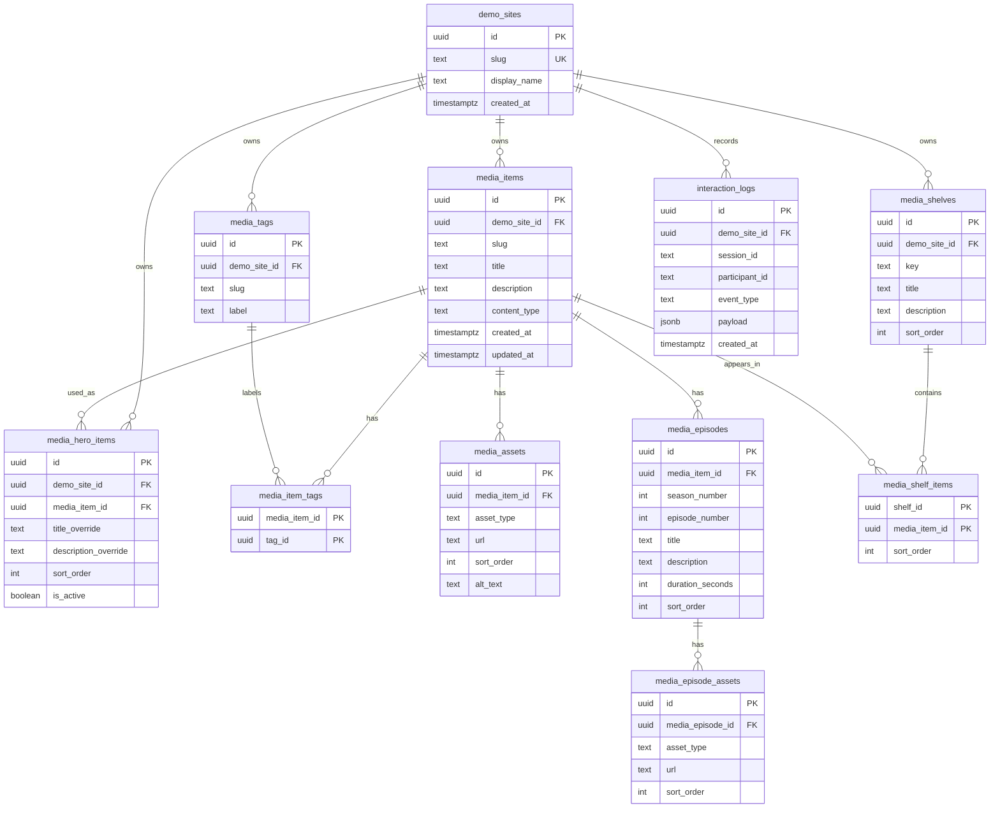

# Netflix Demo API

## Base Path

```text
/api/demos/netflix
```

## Schema

Core catalog tables use 4NF. Multi-valued facts such as tags, assets, shelves, and episodes are stored in separate relations.

## Schema Diagram



### `demo_sites`

| Column | Type | Constraints | Description |
| --- | --- | --- | --- |
| `id` | uuid | primary key | Internal unique identifier for a demo site. |
| `slug` | text | unique, not null | Stable machine-readable site key, e.g. `netflix`. |
| `display_name` | text | not null | User-facing site name shown in tools or admin views, e.g. `AIFLIX`. |
| `created_at` | timestamptz | not null, default now() | Timestamp when the demo site row was created. |

### `media_items`

| Column | Type | Constraints | Description |
| --- | --- | --- | --- |
| `id` | uuid | primary key | Internal unique identifier for a media item. |
| `demo_site_id` | uuid | references `demo_sites(id)`, not null | Demo site that owns this media item. |
| `slug` | text | not null | Stable item key for URLs/API references, generated from the title. |
| `title` | text | not null | Display title of the media item. |
| `description` | text | not null | Long-form synopsis or item description displayed in the hero/detail modal. |
| `content_type` | text | not null | Media type such as `movie`, `series`, or `short`. |
| `created_at` | timestamptz | not null, default now() | Timestamp when the item row was created. |
| `updated_at` | timestamptz | not null, default now() | Timestamp when the item row was last updated. |

Constraints:

```text
unique (demo_site_id, slug)
```

### `media_tags`

| Column | Type | Constraints | Description |
| --- | --- | --- | --- |
| `id` | uuid | primary key | Internal unique identifier for a tag. |
| `demo_site_id` | uuid | references `demo_sites(id)`, not null | Demo site that owns this tag. |
| `slug` | text | not null | Stable machine-readable tag key, e.g. `relaxing`. |
| `label` | text | not null | User-facing tag label, e.g. `Relaxing`. |

Constraints:

```text
unique (demo_site_id, slug)
```

### `media_item_tags`

| Column | Type | Constraints | Description |
| --- | --- | --- | --- |
| `media_item_id` | uuid | references `media_items(id)`, not null | Media item assigned to the tag. |
| `tag_id` | uuid | references `media_tags(id)`, not null | Tag assigned to the media item. |

Constraints:

```text
primary key (media_item_id, tag_id)
```

### `media_assets`

| Column | Type | Constraints | Description |
| --- | --- | --- | --- |
| `id` | uuid | primary key | Internal unique identifier for a media asset. |
| `media_item_id` | uuid | references `media_items(id)`, not null | Media item that owns this asset. |
| `asset_type` | text | not null | Asset role, such as `thumbnail`, `hero`, `preview_video`, or `trailer`. |
| `url` | text | not null | Public URL for the image or video asset. |
| `sort_order` | int | not null, default 0 | Display order among assets of the same type. |
| `alt_text` | text | nullable | Optional accessibility text for image assets. |

Constraints:

```text
unique (media_item_id, asset_type, sort_order)
```

Allowed `asset_type` values:

```text
thumbnail
hero
preview_video
trailer
```

### `media_episodes`

| Column | Type | Constraints | Description |
| --- | --- | --- | --- |
| `id` | uuid | primary key | Internal unique identifier for an episode. |
| `media_item_id` | uuid | references `media_items(id)`, not null | Parent media item for this episode. |
| `season_number` | int | not null, default 1 | Season number used for episode grouping. |
| `episode_number` | int | not null | Episode number within the season. |
| `title` | text | not null | Display title of the episode. |
| `description` | text | not null | Short episode synopsis. |
| `duration_seconds` | int | not null | Episode duration stored as seconds. |
| `sort_order` | int | not null, default 0 | Display order in the episode list. |

Constraints:

```text
unique (media_item_id, season_number, episode_number)
```

### `media_episode_assets`

| Column | Type | Constraints | Description |
| --- | --- | --- | --- |
| `id` | uuid | primary key | Internal unique identifier for an episode asset. |
| `media_episode_id` | uuid | references `media_episodes(id)`, not null | Episode that owns this asset. |
| `asset_type` | text | not null | Asset role, such as `thumbnail` or `video`. |
| `url` | text | not null | Public URL for the episode image or video asset. |
| `sort_order` | int | not null, default 0 | Display order among assets of the same type. |

Constraints:

```text
unique (media_episode_id, asset_type, sort_order)
```

Allowed `asset_type` values:

```text
thumbnail
video
```

### `media_shelves`

| Column | Type | Constraints | Description |
| --- | --- | --- | --- |
| `id` | uuid | primary key | Internal unique identifier for a shelf row. |
| `demo_site_id` | uuid | references `demo_sites(id)`, not null | Demo site that owns this shelf. |
| `key` | text | not null | Stable shelf key, e.g. `trending_now`. |
| `title` | text | not null | User-facing shelf title displayed above a row. |
| `description` | text | nullable | Optional shelf description for admin/API use. |
| `sort_order` | int | not null, default 0 | Display order of the shelf on the page. |

Constraints:

```text
unique (demo_site_id, key)
```

### `media_hero_items`

| Column | Type | Constraints | Description |
| --- | --- | --- | --- |
| `id` | uuid | primary key | Internal unique identifier for a hero placement. |
| `demo_site_id` | uuid | references `demo_sites(id)`, not null | Demo site where the hero content is displayed. |
| `media_item_id` | uuid | references `media_items(id)`, not null | Media item used as hero content. |
| `title_override` | text | nullable | Optional hero-specific title override. |
| `description_override` | text | nullable | Optional hero-specific description override. |
| `sort_order` | int | not null, default 0 | Priority order when multiple hero candidates exist. |
| `is_active` | boolean | not null, default true | Whether this hero placement is active. |

Constraints:

```text
unique (demo_site_id, sort_order)
```

### `media_shelf_items`

| Column | Type | Constraints | Description |
| --- | --- | --- | --- |
| `shelf_id` | uuid | references `media_shelves(id)`, not null | Shelf that contains the item. |
| `media_item_id` | uuid | references `media_items(id)`, not null | Media item displayed in the shelf. |
| `sort_order` | int | not null, default 0 | Card order within the shelf row. |

Constraints:

```text
primary key (shelf_id, media_item_id)
unique (shelf_id, sort_order)
```

### `interaction_logs`

| Column | Type | Constraints | Description |
| --- | --- | --- | --- |
| `id` | uuid | primary key | Internal unique identifier for a log event. |
| `demo_site_id` | uuid | references `demo_sites(id)`, not null | Demo site where the event occurred. |
| `session_id` | text | not null | Study or browser session identifier. |
| `participant_id` | text | nullable | Optional participant code; do not store personal identifiers. |
| `event_type` | text | not null | Event name, e.g. `media_opened` or `search_submitted`. |
| `payload` | jsonb | not null | Event-specific metadata. |
| `created_at` | timestamptz | not null, default now() | Timestamp when the event was recorded. |

## Recommended Indexes

Indexes should be created for fields used in lookup, joins, filtering, and ordering by the Netflix demo APIs.

In Postgres/Supabase, a `unique` constraint already creates the backing unique index. Do not create duplicate indexes when the same uniqueness is already enforced by a table constraint.

### `demo_sites`

```sql
create unique index idx_demo_sites_slug
on demo_sites (slug);
```

Supports:

- resolving `netflix` from `/api/demos/netflix/*`

Note:

- This may be implemented by the `unique` constraint on `demo_sites.slug`.

### `media_items`

```sql
create unique index idx_media_items_demo_slug
on media_items (demo_site_id, slug);
```

Supports:

- item lookup by site and slug
- stable item references in API paths or seed data

Note:

- This may be implemented by the `unique (demo_site_id, slug)` constraint on `media_items`.

### `media_tags`

```sql
create unique index idx_media_tags_demo_slug
on media_tags (demo_site_id, slug);
```

Supports:

- tag filtering by slug, e.g. `tag=relaxing`

Note:

- This may be implemented by the `unique (demo_site_id, slug)` constraint on `media_tags`.

### `media_item_tags`

```sql
create index idx_media_item_tags_tag_item
on media_item_tags (tag_id, media_item_id);
```

Supports:

- finding media items by tag

### `media_assets`

```sql
create index idx_media_assets_item_type_order
on media_assets (media_item_id, asset_type, sort_order);
```

Supports:

- fetching thumbnails, hero images, and preview videos for media items
- ordering multiple assets of the same type

### `media_episodes`

```sql
create index idx_media_episodes_item_order
on media_episodes (media_item_id, season_number, episode_number);
```

Supports:

- fetching ordered episode lists for item detail pages

### `media_episode_assets`

```sql
create index idx_media_episode_assets_episode_type_order
on media_episode_assets (media_episode_id, asset_type, sort_order);
```

Supports:

- fetching episode-specific thumbnails or videos

### `media_shelves`

```sql
create index idx_media_shelves_demo_order
on media_shelves (demo_site_id, sort_order);
```

Supports:

- fetching ordered shelves for home and shelf APIs

### `media_shelf_items`

```sql
create index idx_media_shelf_items_shelf_order
on media_shelf_items (shelf_id, sort_order);
```

Supports:

- fetching ordered media cards inside each shelf

### `media_hero_items`

```sql
create index idx_media_hero_items_demo_active_order
on media_hero_items (demo_site_id, is_active, sort_order);
```

Supports:

- selecting active hero content for the home API

### `interaction_logs`

```sql
create index idx_interaction_logs_session_time
on interaction_logs (session_id, created_at);

create index idx_interaction_logs_demo_time
on interaction_logs (demo_site_id, created_at);
```

Supports:

- analyzing logs by participant/session timeline
- analyzing logs by demo site and time range

## Response Models

### `MediaAsset`

```json
{
  "type": "thumbnail",
  "url": "https://example.com/image.jpg",
  "altText": "Space Journey thumbnail"
}
```

### `MediaItemSummary`

```json
{
  "id": "media_001",
  "slug": "space-journey",
  "title": "Space Journey",
  "description": "인류의 마지막 경계...",
  "contentType": "series",
  "tags": [
    { "slug": "relaxing", "label": "Relaxing" }
  ],
  "assets": [
    {
      "type": "thumbnail",
      "url": "https://images.unsplash.com/photo-1446776811953-b23d57bd21aa?w=800",
      "altText": "Space Journey thumbnail"
    }
  ]
}
```

### `MediaEpisode`

```json
{
  "id": "episode_001",
  "seasonNumber": 1,
  "episodeNumber": 1,
  "title": "새로운 시작",
  "description": "첫 번째 탐사를 준비하는 대원들의 긴장된 순간.",
  "durationSeconds": 2700,
  "durationLabel": "45m",
  "assets": []
}
```

### `MediaItemDetail`

```json
{
  "id": "media_001",
  "slug": "space-journey",
  "title": "Space Journey",
  "description": "인류의 마지막 경계...",
  "contentType": "series",
  "tags": [
    { "slug": "relaxing", "label": "Relaxing" }
  ],
  "assets": [
    {
      "type": "thumbnail",
      "url": "https://images.unsplash.com/photo-1446776811953-b23d57bd21aa?w=800",
      "altText": "Space Journey thumbnail"
    },
    {
      "type": "preview_video",
      "url": "https://www.w3schools.com/html/mov_bbb.mp4",
      "altText": null
    }
  ],
  "episodes": [
    {
      "id": "episode_001",
      "seasonNumber": 1,
      "episodeNumber": 1,
      "title": "새로운 시작",
      "description": "첫 번째 탐사를 준비하는 대원들의 긴장된 순간.",
      "durationSeconds": 2700,
      "durationLabel": "45m",
      "assets": []
    }
  ]
}
```

### `MediaShelf`

```json
{
  "key": "trending_now",
  "title": "Trending Now",
  "description": null,
  "items": []
}
```

### `NetflixHome`

```json
{
  "demo": "netflix",
  "hero": {
    "id": "media_001",
    "slug": "space-journey",
    "title": "Space Journey",
    "description": "인류의 마지막 경계...",
    "contentType": "series",
    "tags": [
      { "slug": "relaxing", "label": "Relaxing" }
    ],
    "assets": [
      {
        "type": "hero",
        "url": "https://images.unsplash.com/photo-1446776811953-b23d57bd21aa?w=1200",
        "altText": "Space Journey hero image"
      },
      {
        "type": "preview_video",
        "url": "https://www.w3schools.com/html/mov_bbb.mp4",
        "altText": null
      }
    ]
  },
  "shelves": []
}
```

## Endpoints

### Get Home Data

Returns all data required to render the Netflix demo home page in one request. The response includes the active hero item and ordered shelf rows with their media item summaries.

```http
GET /api/demos/netflix/home
```

Query parameters:

| Name | Type | Required | Description |
| --- | --- | --- | --- |
| `limitPerShelf` | int | no | max items per shelf |

Response `200`:

```json
{
  "demo": "netflix",
  "hero": {
    "id": "media_001",
    "slug": "space-journey",
    "title": "Space Journey",
    "description": "인류의 마지막 경계...",
    "contentType": "series",
    "tags": [
      { "slug": "relaxing", "label": "Relaxing" }
    ],
    "assets": [
      {
        "type": "hero",
        "url": "https://images.unsplash.com/photo-1446776811953-b23d57bd21aa?w=1200",
        "altText": "Space Journey hero image"
      },
      {
        "type": "preview_video",
        "url": "https://www.w3schools.com/html/mov_bbb.mp4",
        "altText": null
      }
    ]
  },
  "shelves": [
    {
      "key": "trending_now",
      "title": "Trending Now",
      "description": null,
      "items": [
        {
          "id": "media_001",
          "slug": "space-journey",
          "title": "Space Journey",
          "description": "인류의 마지막 경계...",
          "contentType": "series",
          "tags": [
            { "slug": "relaxing", "label": "Relaxing" }
          ],
          "assets": [
            {
              "type": "thumbnail",
              "url": "https://images.unsplash.com/photo-1446776811953-b23d57bd21aa?w=800",
              "altText": "Space Journey thumbnail"
            }
          ]
        }
      ]
    }
  ]
}
```

### List Shelves

Returns ordered Netflix-style shelf rows without the hero item. Use this when the frontend needs to refresh shelf rows independently from the rest of the home page.

```http
GET /api/demos/netflix/shelves
```

Query parameters:

| Name | Type | Required | Description |
| --- | --- | --- | --- |
| `limitPerShelf` | int | no | max items per shelf |

Response `200`:

```json
{
  "demo": "netflix",
  "shelves": [
    {
      "key": "trending_now",
      "title": "Trending Now",
      "description": null,
      "items": [
        {
          "id": "media_001",
          "slug": "space-journey",
          "title": "Space Journey",
          "description": "인류의 마지막 경계...",
          "contentType": "series",
          "tags": [
            { "slug": "relaxing", "label": "Relaxing" }
          ],
          "assets": [
            {
              "type": "thumbnail",
              "url": "https://images.unsplash.com/photo-1446776811953-b23d57bd21aa?w=800",
              "altText": "Space Journey thumbnail"
            }
          ]
        }
      ]
    }
  ]
}
```

### Get Item Detail

Returns full detail data for one known media item. Use this after the frontend already knows the target `itemId`, such as when a user clicks a specific card and opens the expanded detail modal. This endpoint is for rendering one selected item's detail view, including preview video and episode data.

```http
GET /api/demos/netflix/items/{itemId}
```

Path parameters:

| Name | Type | Required | Description |
| --- | --- | --- | --- |
| `itemId` | uuid/text | yes | media item id |

Response `200`:

```json
{
  "id": "media_001",
  "slug": "space-journey",
  "title": "Space Journey",
  "description": "인류의 마지막 경계...",
  "contentType": "series",
  "tags": [
    { "slug": "relaxing", "label": "Relaxing" }
  ],
  "assets": [
    {
      "type": "thumbnail",
      "url": "https://images.unsplash.com/photo-1446776811953-b23d57bd21aa?w=800",
      "altText": "Space Journey thumbnail"
    },
    {
      "type": "preview_video",
      "url": "https://www.w3schools.com/html/mov_bbb.mp4",
      "altText": null
    }
  ],
  "episodes": [
    {
      "id": "episode_001",
      "seasonNumber": 1,
      "episodeNumber": 1,
      "title": "새로운 시작",
      "description": "첫 번째 탐사를 준비하는 대원들의 긴장된 순간.",
      "durationSeconds": 2700,
      "durationLabel": "45m",
      "assets": []
    }
  ]
}
```

Response `404`:

```json
{
  "error": {
    "code": "ITEM_NOT_FOUND",
    "message": "Media item not found."
  }
}
```

### Search Items

Returns a list of media item summaries that match search or filter conditions. Use this when the frontend does not yet know the exact item to open, such as search input, tag filtering, or candidate lookup. This endpoint returns multiple possible items; use `GET /api/demos/netflix/items/{itemId}` afterward if the user selects one item and needs full detail data.

```http
GET /api/demos/netflix/items
```

Query parameters:

| Name | Type | Required | Description |
| --- | --- | --- | --- |
| `query` | text | no | search text for title/description |
| `tag` | text | no | tag slug |
| `limit` | int | no | default 20 |
| `offset` | int | no | default 0 |

Response `200`:

```json
{
  "items": [
    {
      "id": "media_001",
      "slug": "space-journey",
      "title": "Space Journey",
      "description": "인류의 마지막 경계...",
      "contentType": "series",
      "tags": [
        { "slug": "relaxing", "label": "Relaxing" }
      ],
      "assets": [
        {
          "type": "thumbnail",
          "url": "https://images.unsplash.com/photo-1446776811953-b23d57bd21aa?w=800",
          "altText": "Space Journey thumbnail"
        }
      ]
    }
  ],
  "pagination": {
    "limit": 20,
    "offset": 0,
    "total": 1
  }
}
```

### Save Interaction Log

Stores a user interaction event for the Netflix demo. Use this for study instrumentation such as search submissions, media opens, modal closes, play clicks, and AI-related UI events.

```http
POST /api/logs
```

Request body:

```json
{
  "demo": "netflix",
  "sessionId": "session_001",
  "participantId": "P01",
  "eventType": "media_opened",
  "payload": {
    "itemId": "media_001",
    "source": "card_click",
    "shelfKey": "trending_now"
  }
}
```

Response `201`:

```json
{
  "ok": true,
  "logId": "log_001"
}
```

## Error Model

```json
{
  "error": {
    "code": "ERROR_CODE",
    "message": "Human-readable error message."
  }
}
```

Common errors:

| HTTP | Code | Description |
| --- | --- | --- |
| 400 | `INVALID_REQUEST` | request body or query parameters are invalid |
| 404 | `ITEM_NOT_FOUND` | item does not exist |
| 500 | `INTERNAL_ERROR` | unexpected backend error |
