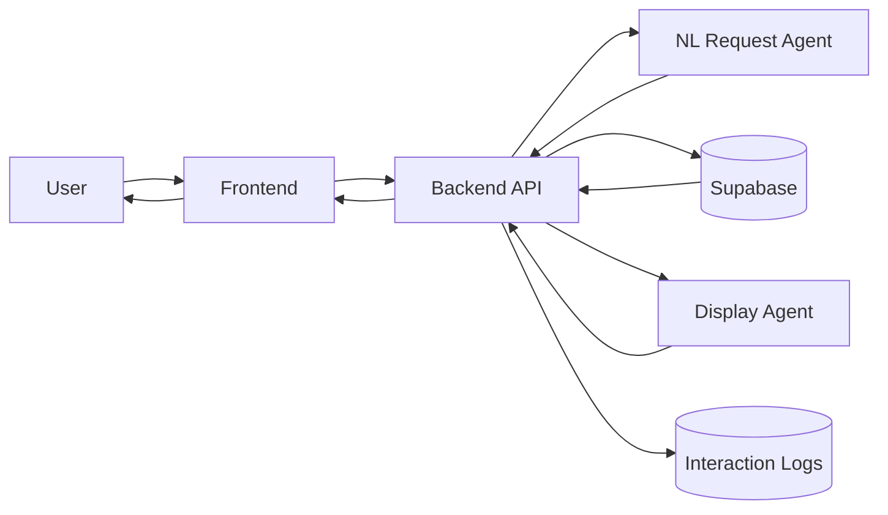
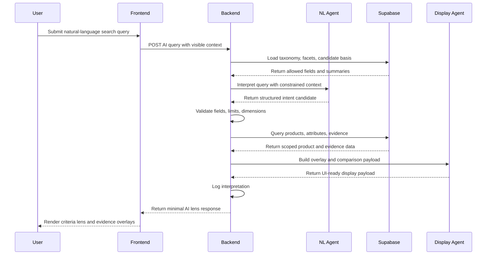
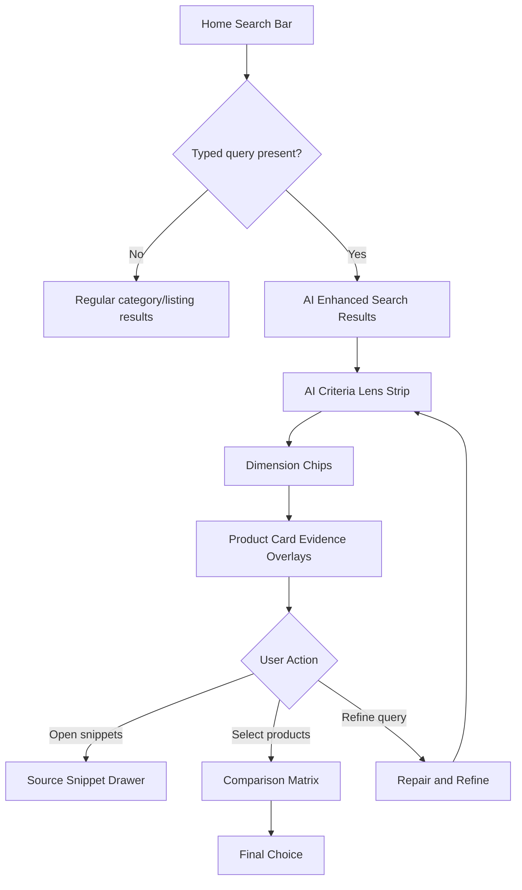

# AI Criteria Lens Specification

## 0. Document Purpose

This document defines the product goal, feature behavior, UI/UX flow, data contract expectations, and implementation requirements for the **AI Criteria Lens** feature in the HAI project.

The intended reader is a developer who has not participated in prior team discussions. After reading this document, the developer should understand:

* what problem this feature solves,
* how it differs from a chatbot or normal AI search,
* how the user moves through the interface,
* how database attributes should be used,
* what frontend components need to be implemented,
* what backend/AI payloads are expected,
* what data should and should not be exposed to the frontend.

This document should be read together with:

* `docs/SERVICE_DATA_FLOW.md`
* `docs/PROJECT.md`
* `docs/IMPLEMENTATION.md`
* `docs/STUDY.md`

The current service architecture requires that the frontend never calls an LLM API directly, the LLM never writes SQL or arbitrary backend endpoint URLs, and the backend acts as the gatekeeper for query planning, schema validation, filtering, pagination, logging, and data minimization. Supabase remains the source of truth for catalog, attributes, reviews, profiles, evidence, and logs. 

---

## 1. Feature Name

**AI Criteria Lens**

Internal project framing:

> AI Criteria Lens is an AI-assisted comparison layer that activates from the existing search bar, interprets the user’s shopping goal, extracts comparison dimensions from database-backed product attributes, and attaches decision evidence directly to product cards in the search result grid.

This feature is part of the broader **GroundedCompare** direction: AI evidence overlays that help users compare multiple visible items directly inside a dense result grid. The project goal is not to build a generic shopping chatbot, but to spatially ground comparison evidence in the current UI. 

Current Amazon implementation update: the UI now prioritizes a visible `Parsed criteria` layer and a bottom comparison matrix over per-card evidence drawers. Product image/name clicks remain product-detail navigation. Product cards expose compact match tags and `+ Compare`; selected products can be added to or removed from the comparison matrix at the bottom of the same search results page. Detailed evidence remains backend-grounded API data, but the default UI does not use a drawer.

---

## 2. Problem Statement

In e-commerce result pages, users often see many similar products. Even after a search query narrows the candidate set, users still need to compare products across dimensions such as:

* price,
* size or fit,
* material,
* brand,
* country or origin,
* review risks,
* evidence strength,
* durability,
* comfort,
* weight,
* battery life,
* shipping or return concerns.

A normal search result page gives users product cards and filters. However, users often need to repeatedly open product detail pages, read reviews, return to the result grid, open another product, and mentally compare the differences.

The core user pain point is not just finding products. The core pain point is:

> After search returns relevant products, users still need to compare tradeoffs among similar candidates.

Therefore, the AI feature should not merely repeat the search query match, such as “this product is warm” or “this product is lower-priced.” The user already searched for those conditions. Instead, the AI should explain how each returned candidate differs from the others.

---

## 3. Feature Goal

The goal of AI Criteria Lens is to help users compare products **within the current search result grid**.

The feature should:

1. start from the existing search bar,
2. treat natural-language parsing as always on for typed queries while keeping an icon-only AI state control inside the search bar,
3. submit the query through the normal search flow,
4. open an AI-enhanced search result page,
5. extract comparison dimensions from the user query and database-backed attributes,
6. allow users to adjust comparison dimensions,
7. attach concise decision evidence to relevant product cards,
8. support lazy-loaded evidence snippets,
9. support a comparison tray or matrix for selected products,
10. allow refine and repair interactions without opening a separate chatbot panel.

---

## 4. Non-Goals

This feature is **not**:

* a general chatbot,
* a floating AI character,
* a full Amazon clone,
* a product purchasing flow,
* an autonomous agent that buys or selects products for the user,
* a system that exposes raw database distributions to the frontend,
* a system that lets the LLM write SQL,
* a system that lets the frontend call the LLM directly,
* a system that invents product evidence outside backend-approved data.

The AI should help users compare products. It should not make the final decision for the user.

---

## 5. Difference from Existing Services

### 5.1 Difference from Amazon Rufus / Alexa for Shopping

Amazon Rufus is described as a conversational shopping assistant trained on Amazon’s product catalog, customer reviews, community Q&A, and web information. It can answer shopping questions, provide comparisons, and make recommendations. Amazon’s own description says customers can type or speak questions into the search bar and a chat dialog appears at the bottom of the screen. ([Amazon News][1])

AI Criteria Lens differs from this in the output format.

| Existing conversational assistant | AI Criteria Lens                           |
| --------------------------------- | ------------------------------------------ |
| Chat dialog or assistant panel    | Product-grid evidence layer                |
| Text answer first                 | Product-card evidence first                |
| Conversation-centered             | Result-grid-centered                       |
| AI response separated from items  | Evidence attached to visible product cards |
| Assistant may recommend           | User compares and decides                  |

One-sentence distinction:

> AI Criteria Lens is not a shopping chatbot. It is a search-result comparison lens.

### 5.2 Difference from Amazon AI Review Highlights

Amazon’s AI-generated review highlights provide a short paragraph on the product detail page summarizing shared positive, neutral, and negative opinions from customer reviews. Users first search, click a product, go to the product page, and inspect the review section. Amazon also lets users click product feature phrases to inspect positive and negative review snippets. ([Amazon News][2])

AI Criteria Lens differs in three ways:

| Amazon Review Highlights                | AI Criteria Lens                        |
| --------------------------------------- | --------------------------------------- |
| Product detail page                     | Search result grid                      |
| One product at a time                   | Multiple visible products               |
| Review summary after opening details    | Evidence preview before opening details |
| Feature summaries inside review section | Comparison dimensions attached to cards |
| Helps inspect one product               | Helps compare candidate set             |

One-sentence distinction:

> AI Criteria Lens moves evidence comparison from the product detail page to the search result grid.

---

## 6. Core UX Principle

The main UX principle is:

> AI search retrieves candidates; AI Criteria Lens explains tradeoffs among candidates.

This means:

* Search narrows the candidate set.
* Criteria Lens explains how the candidates differ.
* Overlay content should focus on differentiators, tradeoffs, and evidence strength.
* Overlay content should not simply repeat the user’s query.

Bad overlay:

```text
+ Warm
+ Lower-priced
+ Good for commuting
```

Good overlay:

```text
Best warmth evidence
Risk: repeated weight complaints
Evidence strength: strong
```

---

## 7. Attribute-Driven Design

The comparison dimensions should not be hardcoded only from the whiteboard sketch. The whiteboard used rough examples such as price, size, color, brand, material, and country. In implementation, the system should use the actual product attributes stored in the database.

The backend schema already supports product attributes and review evidence. The Amazon API documentation includes product attributes, attribute definitions, product attribute values, and review evidence linked to product attributes. 

Therefore, comparison dimensions should be generated from:

1. base product fields,
2. database attribute definitions,
3. product attribute values,
4. review evidence,
5. issue/risk evidence,
6. user query terms,
7. currently visible candidate products.

### 7.1 Attribute Sources

| Source                   | Examples                                       | Usage                              |
| ------------------------ | ---------------------------------------------- | ---------------------------------- |
| Base product fields      | price, rating, reviewCount, brand              | Always available comparison fields |
| Category/subcategory     | outerwear, coats, electronics                  | Hard filtering / result context    |
| Attribute definitions    | material, warmthLevel, weightGrams, waterproof | Candidate comparison dimensions    |
| Product attribute values | material = wool blend, warmthLevel = 5         | Card-level comparison evidence     |
| Review evidence          | too_heavy, uncomfortable_fit, weak_battery     | Risk and provenance                |
| Reviewer profile fields  | heightCm, bodyType, fitResult                  | Optional fit-related evidence      |
| Query terms              | “warm”, “commute”, “not too expensive”         | Lens criteria extraction           |

### 7.2 Dimension Selection Logic

AI Criteria Lens should select dimensions using the following priority:

1. **User-mentioned dimensions**
   If the query mentions material, brand, country, weight, fit, battery, comfort, etc., those dimensions should be prioritized.

2. **Category-relevant attributes**
   For coats, warmth, material, weight, shoulder fit, waterproofing, and work/commute suitability may matter.
   For headphones, battery, noise isolation, comfort, weight, connectivity, and durability may matter.

3. **High-variance dimensions among candidates**
   If all products have the same value for an attribute, it is less useful for comparison.
   If products differ meaningfully, it is useful.

4. **Evidence-backed dimensions**
   Dimensions with review evidence should be prioritized because users can inspect snippets.

5. **User-selected dimensions**
   The user can manually toggle dimensions on or off.

---

## 8. Information Exposure Policy

The frontend should receive only information needed for the current UI state.

The backend may use rich internal data, but the frontend should receive minimal UI-ready data. `SERVICE_DATA_FLOW.md` explicitly recommends limiting search results, evidence previews, risk labels, and comparison tray size. 

### 8.1 Do Not Expose to Frontend by Default

```text
- raw price distribution
- raw rating distribution
- full facet distributions
- all review rows
- all evidence rows
- all reviewer profile distributions
- internal scoring weights
- query planning traces
- raw LLM prompts
- debug data
- SQL-like query plans
```

### 8.2 Frontend May Receive

```text
- human-readable interpretation summary
- applied rules in plain language
- product card display data
- selected comparison dimensions
- item-level differentiator
- item-level tradeoff/risk summary
- evidence strength label
- 0-2 evidence preview snippets per product
- next action suggestions
- pagination
```

### 8.3 Debug Mode

Debug mode may expose more internal information during development.

Study mode must not expose:

```text
- hidden prompt data
- debug traces
- raw facet distributions
- raw score breakdowns
```

`SERVICE_DATA_FLOW.md` also states that hidden prompt/debug data should not appear in study-mode responses. 

---

## 9. UI Components

### 9.1 Existing Search Bar with Icon-Only AI State Control

The AI feature should be available inside the existing search bar. In the current implementation, typed natural-language searches always use AI parsing; the icon communicates AI Criteria Lens state and records user interaction rather than gating whether parsing happens.

Visible text such as `AI Compare ON` should not be shown inside the search bar. Use only an AI-feeling icon such as a sparkle, magic, lens, or orbit icon.

Example:

```text
[ All ▼ | warm commute coat, compare material brand country      ✦  🔍 ]
```

The AI icon has four states:

| State   | Visual                              | Meaning                        |
| ------- | ----------------------------------- | ------------------------------ |
| Idle    | highlighted icon with subtle glow   | AI parsing is available        |
| Pressed | highlighted icon                    | state control interaction logged |
| Loading | highlighted icon + loading motion   | backend is interpreting        |
| Applied | highlighted icon + small check mark | AI lens applied to result grid |

Because icon-only controls can be ambiguous, the implementation must include accessibility metadata. NN/g notes that icons are often hard for users to interpret unless their meaning is standardized or supported by labels/tooltips. ([Nielsen Norman Group][3]) MDN documents `aria-pressed` as a way to expose toggle button state to assistive technology. ([MDN Web Docs][4])

Required accessibility attributes:

```html
<button
  type="button"
  aria-label="AI parsing is always on"
  title="AI parsing is always on"
  aria-pressed="true"
>
  ✦
</button>
```

### 9.2 AI Criteria Lens Strip

After search, the result page should show a compact lens strip.

Example:

```text
AI Criteria Lens

Candidate set:
Commute coats under current search

Comparison dimensions:
[Price] [Size/Fit] [Material] [Brand] [Country] [Review Risks]
```

Purpose:

* show how the query was interpreted,
* show which comparison dimensions are active,
* let the user add/remove dimensions,
* avoid showing raw backend distributions.

### 9.3 Dimension Chips

Dimension chips represent database-backed comparison dimensions.

Examples:

```text
[Price]
[Size/Fit]
[Material]
[Brand]
[Country]
[Review Risks]
[Weight]
[Comfort]
[Durability]
[Battery]
```

Each chip should map to a structured backend dimension.

Example dimension object:

```json
{
  "key": "material",
  "label": "Material",
  "source": "product_attribute_definitions",
  "dataType": "enum",
  "active": true,
  "hasEvidence": true
}
```

### 9.4 Numbered Product Cards

Product cards should show stable visible numbers on the current result page.

Example:

```text
[2] Northvale Harbor Wool Coat
$99.99 · 4.4★ · 52 reviews
```

Visible numbers allow the user to say:

```text
Compare 2 and 5
Replace 3 with the one on the right
Show negative reviews for 4
```

### 9.5 Decision Evidence Overlay

Selected or AI-highlighted product cards show compact evidence overlays.

Example:

```text
Decision evidence

Best warmth evidence
Risk: repeated weight complaints
Evidence: strong
[snippets]
```

The overlay must focus on:

* differentiator,
* tradeoff,
* evidence strength,
* provenance preview.

It must not merely repeat the search query.

### 9.6 Source Snippet Drawer

When the user clicks `snippets`, the UI should lazy-load more evidence for that item.

Example:

```text
Source snippets for #2

Positive:
“It kept me warm through a windy commute.”

Risk:
“The coat felt heavier than expected.”
```

The first response should stay compact. More evidence should load only after user intent is clear. `SERVICE_DATA_FLOW.md` recommends lazy loading detailed evidence, full reviews, and product details only after the user requests them. 

### 9.7 Comparison Matrix / Sticky Tray

When the user selects 2–4 products, show a comparison matrix or sticky tray.

Example:

```text
Comparison Matrix

Item   Price   Fit            Material      Brand/Country   Risk
#2     $99     true-to-size   wool blend    Northvale / KR  heavy
#5     $129    shoulder risk  cashmere mix  Harbor / US     fit
#6     $79     mixed          poly blend    Urban / CN      thin evidence
```

The tray should not contain all raw evidence. It should summarize the selected dimensions.

### 9.8 Refine / Repair Actions

The result page should support refinement without opening a separate chat window.

Examples:

```text
prioritize material quality
hide thin-evidence products
replace #6 with one from a Korean brand
show only negative reviews
add one more similar item
```

The UI should show a concise update:

```text
Updated lens:
Material quality first; removed thin-evidence products.

Removed #6 because evidence was thin.
Added #4 as a better material-confidence candidate.

[Undo] [Show snippets] [Add one more] [Finalize choice]
```

---

## 10. End-to-End User Scenario

### Scenario

The user wants to buy a warm coat for commuting. They care about price, fit, material, brand, country, and repeated review risks.

### Step 0: User searches from the existing search bar

```text
[ All ▼ | warm commute coat, compare material brand country      ✦  🔍 ]
```

The AI icon is already active for typed natural-language queries. The user submits the query through the normal search action.

### Step 1: Search result page opens

The system opens a search result page. The AI icon enters loading state.

```text
Backend interprets query.
Frontend receives minimal UI-ready payload.
No raw facets, score weights, or full reviews are exposed.
```

### Step 2: AI Criteria Lens appears

```text
AI Criteria Lens

Candidate set:
Commute coats under current search

Comparison dimensions:
[Price] [Size/Fit] [Material] [Brand] [Country] [Review Risks]
```

### Step 3: User adjusts dimensions

The user disables `Color` and keeps:

```text
[Price]
[Size/Fit]
[Material]
[Brand]
[Country]
[Review Risks]
```

### Step 4: Product cards show evidence overlays

```text
#2 Northvale Coat

Decision evidence
Best warmth evidence
Risk: repeated weight
Evidence: strong
[snippets]
```

```text
#5 Harbor Coat

Decision evidence
Best brand confidence
Risk: shoulder fit
Evidence: strong
[snippets]
```

```text
#6 Urban Coat

Decision evidence
Lowest price
Risk: thin evidence
Evidence: medium
[snippets]
```

### Step 5: User opens snippets

```text
Positive:
“It kept me warm through a windy commute.”

Risk:
“The coat felt heavier than expected.”
```

### Step 6: User compares selected products

```text
Comparison Matrix

#2: strongest warmth evidence, heavier risk
#5: brand confidence, shoulder-fit concern
#6: lowest price, thin evidence coverage
```

### Step 7: User refines

```text
prioritize material quality, hide thin-evidence products
```

System updates:

```text
Removed #6 because evidence was thin.
Added #4 as a better material-confidence candidate.
[Undo]
```

### Step 8: User finalizes

The user makes the final choice manually.

The system logs:

```text
query_submitted
lens_applied
dimension_toggled
overlay_shown
snippet_opened
product_selected
comparison_opened
refine_command
selection_replaced
final_choice
```

---

## 11. Service Flow



Flow meaning:

1. The user enters a query through the existing search bar.
2. The frontend sends the raw query and current UI context to the backend.
3. The backend fetches allowed taxonomy, facets, and attribute context.
4. The backend calls the NL request agent with constrained context.
5. The backend validates all AI output.
6. The backend queries Supabase through allowlisted query builders.
7. The display agent converts scoped data into UI-ready overlays and tray payloads.
8. The frontend renders product cards, dimension chips, overlays, snippets, and tray.
9. The backend logs query interpretation and user interactions.

This follows the intended service ownership in `SERVICE_DATA_FLOW.md`. 

---

## 12. Runtime Sequence



---

## 13. Screen Flow



---

## 14. Backend Response Shape

The backend should return compact UI-ready data.

Example:

```json
{
  "queryId": "aiq_001",
  "status": "ok",
  "interpretation": {
    "summary": "Commute coats under current search",
    "candidateSet": "Lower-priced commute coats",
    "warning": "Fit guidance is based on review evidence, not exact body prediction."
  },
  "comparisonDimensions": [
    {
      "key": "price",
      "label": "Price",
      "source": "base_product_field",
      "active": true
    },
    {
      "key": "sizeFit",
      "label": "Size/Fit",
      "source": "review_profile_and_evidence",
      "active": true
    },
    {
      "key": "material",
      "label": "Material",
      "source": "product_attribute_definitions",
      "active": true
    },
    {
      "key": "brandCountry",
      "label": "Brand/Country",
      "source": "product_metadata",
      "active": true
    },
    {
      "key": "reviewRisks",
      "label": "Review Risks",
      "source": "product_review_evidence",
      "active": true
    }
  ],
  "items": [
    {
      "id": "product-uuid-2",
      "visibleNumber": 2,
      "slug": "northvale-harbor-wool-coat",
      "name": "Northvale Harbor Wool Coat",
      "imageUrl": "https://example.com/image.jpg",
      "price": {
        "amount": 99.99,
        "currencyCode": "USD"
      },
      "rating": 4.4,
      "reviewCount": 52,
      "decisionEvidence": {
        "primaryDifferentiator": "Best warmth evidence among returned items",
        "tradeoffs": ["Repeated weight complaints"],
        "evidenceStrength": "strong",
        "comparisonDimensions": ["price", "sizeFit", "material", "brandCountry", "reviewRisks"],
        "snippetsPreview": [
          {
            "type": "supporting",
            "text": "It kept me warm through a windy commute."
          },
          {
            "type": "risk",
            "text": "The coat felt heavier than I wanted."
          }
        ]
      }
    }
  ],
  "actions": [
    {
      "type": "refine",
      "label": "Prioritize material quality",
      "command": "prioritize_material_quality"
    },
    {
      "type": "refine",
      "label": "Hide thin-evidence products",
      "command": "hide_thin_evidence"
    },
    {
      "type": "compare",
      "label": "Compare selected products",
      "command": "compare_selected"
    }
  ],
  "pagination": {
    "limit": 12,
    "nextCursor": 24
  }
}
```

---

## 15. Lazy Evidence Endpoint

Initial AI query responses should include only preview snippets.

When the user requests more evidence for one product:

```text
GET /api/ai/amazon/query/:queryId/items/:productId/evidence
```

Expected response:

```json
{
  "queryId": "aiq_001",
  "productId": "product-uuid-2",
  "dimension": "reviewRisks",
  "evidence": [
    {
      "sentiment": "positive",
      "attributeKey": "warmthLevel",
      "text": "It kept me warm through a windy commute.",
      "source": "review",
      "reviewId": "review-uuid-1"
    },
    {
      "sentiment": "negative",
      "issueType": "too_heavy",
      "text": "The coat felt heavier than I wanted.",
      "source": "review",
      "reviewId": "review-uuid-2"
    }
  ]
}
```

---

## 16. Compare Endpoint

When the user selects 2–4 products:

```text
POST /api/ai/amazon/compare
```

Request:

```json
{
  "queryId": "aiq_001",
  "selectedProductIds": ["product-uuid-2", "product-uuid-5", "product-uuid-6"],
  "activeDimensions": ["price", "sizeFit", "material", "brandCountry", "reviewRisks"]
}
```

Response:

```json
{
  "queryId": "aiq_001",
  "comparison": {
    "dimensions": ["Price", "Size/Fit", "Material", "Brand/Country", "Review Risks"],
    "rows": [
      {
        "productId": "product-uuid-2",
        "visibleNumber": 2,
        "cells": {
          "price": "$99.99",
          "sizeFit": "true-to-size",
          "material": "wool blend",
          "brandCountry": "Northvale / KR",
          "reviewRisks": "repeated weight complaints"
        }
      }
    ]
  }
}
```

---

## 17. Refine / Repair Endpoint

When the user refines the result:

```text
POST /api/ai/amazon/refine
```

Example commands:

```text
prioritize material quality
hide thin-evidence products
replace 6 with one from a Korean brand
show only negative reviews
```

Request:

```json
{
  "queryId": "aiq_001",
  "command": "prioritize material quality, hide thin-evidence products",
  "currentSelectedProductIds": ["product-uuid-2", "product-uuid-5", "product-uuid-6"],
  "activeDimensions": ["price", "sizeFit", "material", "brandCountry", "reviewRisks"]
}
```

Response:

```json
{
  "queryId": "aiq_001",
  "status": "ok",
  "updateSummary": "Prioritized material quality and removed thin-evidence products.",
  "removedItems": [
    {
      "productId": "product-uuid-6",
      "reason": "Evidence coverage was thin."
    }
  ],
  "addedItems": [
    {
      "productId": "product-uuid-4",
      "reason": "Better material-confidence candidate."
    }
  ],
  "items": [],
  "actions": [
    {
      "type": "undo",
      "label": "Undo",
      "command": "undo_last_refine"
    }
  ]
}
```

---

## 18. Frontend Implementation Requirements

### 18.1 Search Bar

Implement:

```text
- icon-only AI state control inside existing search bar
- AI idle/loading/applied/error states
- aria-label
- aria-pressed
- title tooltip
- keyboard focus state
```

### 18.2 Listing State

Recommended state shape:

```js
const [listing, setListing] = useState({
  category: null,
  query: "",
  mode: "regular", // "regular" | "ai"
  aiQueryId: null,
  aiStatus: "idle", // "idle" | "loading" | "applied" | "error"
});
```

### 18.3 Criteria Lens State

```js
const [criteriaLens, setCriteriaLens] = useState({
  interpretation: null,
  dimensions: [],
  items: [],
  selectedProductIds: [],
  expandedEvidenceProductId: null,
  comparison: null,
  actions: []
});
```

### 18.4 Product Card

Each product card should support:

```text
- visible number badge
- selected state
- evidence overlay
- snippets button
- details button
- add/remove from comparison
```

### 18.5 Logging

Log at least:

```text
query_submitted
ai_icon_toggled
ai_lens_applied
dimension_toggled
product_selected
overlay_shown
snippet_opened
comparison_opened
refine_command
selection_replaced
undo_clicked
final_choice
```

The existing backend has a shared log endpoint under `/api/logs`. 

---

## 19. Backend Implementation Requirements

Backend should:

```text
1. Own all /api/ai/amazon/* orchestration.
2. Fetch allowed taxonomy and candidate facets.
3. Call NL request agent only with constrained context.
4. Validate returned intent and dimensions.
5. Use only allowlisted category, subcategory, sort, filter, and attribute keys.
6. Query Supabase through typed repository functions.
7. Select compact evidence previews.
8. Build display payload through display agent.
9. Return minimal UI-ready response.
10. Log interpretation and UI event metadata.
```

`SERVICE_DATA_FLOW.md` states that backend should own `/api/ai/amazon/*` orchestration, validate AI output, query Supabase through typed repository functions, return compact UI-ready payloads, and write study/runtime logs. 

---

## 20. AI Agent Requirements

### 20.1 NL Request Agent

Responsibilities:

```text
- Parse user query.
- Separate hard filters, soft preferences, and comparison dimensions.
- Use only backend-provided attribute keys and taxonomy.
- Mark ambiguous cases for clarification.
- Avoid inventing unsupported filters or attributes.
```

### 20.2 Display Agent

Responsibilities:

```text
- Convert backend item/evidence data into UI-ready overlays.
- Generate comparison dimension labels.
- Build comparison tray payloads.
- Preserve provenance snippets.
- Include uncertainty or warning text when evidence is thin.
- Avoid deciding the user's final choice.
```

The repo’s display-agent contract already states that the display agent should transform backend/AI results into overlay, tray, snippet, warning, and repair display models while avoiding final-choice decisions for the user. 

---

## 21. Acceptance Criteria

The feature is acceptable when the following are true.

### 21.1 UX Acceptance

* Typed natural-language searches always route through the AI Criteria Lens parser.
* The search bar includes an icon-only AI state control/indicator.
* No visible text such as `AI Compare ON` is required inside the search bar.
* The result page shows AI Criteria Lens after AI search.
* The result page shows database-backed comparison dimensions.
* The user can toggle comparison dimensions.
* Product cards show decision evidence overlays.
* The overlay explains tradeoffs, not just query match.
* The user can open source snippets.
* The user can compare 2–4 selected products.
* The user can refine or repair the result.
* The user can undo at least one refine/repair action.

### 21.2 Data Acceptance

* Frontend does not receive raw facet distributions by default.
* Frontend does not receive all reviews in the initial response.
* Frontend does not receive internal score weights.
* Evidence snippets are grounded in stored review/evidence data.
* Product attributes come from database-backed fields.
* Displayed dimensions map to allowed backend keys.
* Debug information is hidden in study mode.

### 21.3 Study Acceptance

* The system can log user interactions.
* The system can support at least three study conditions:

  * regular browsing,
  * chat-only or non-spatial AI summary,
  * AI Criteria Lens with in-place evidence.
* The system can measure:

  * detail page opens,
  * task time,
  * selected products,
  * snippet expansions,
  * final choice,
  * justification quality,
  * perceived control,
  * trust,
  * workload.

---

## 22. Implementation Priority

Recommended order:

```text
1. Add icon-only AI state control inside search bar.
2. Add listing.mode = regular | ai.
3. Add AI loading/applied state.
4. Add AI Criteria Lens strip.
5. Load comparison dimensions from response payload.
6. Add dimension chips.
7. Add visible product numbers.
8. Add product card decision evidence overlay.
9. Add source snippet drawer.
10. Add multi-select and comparison matrix/tray.
11. Add refine/repair actions.
12. Add logging.
13. Connect to backend AI endpoints.
14. Replace mock payloads with Supabase-backed evidence.
```

---

## 23. Suggested File Placement

Save this document as:

```text
docs/AI_CRITERIA_LENS_SPEC.md
```

If implementation contracts become large, split them later:

```text
docs/AI_CRITERIA_LENS_SPEC.md
ai/shared/criteria-lens-contract.md
backend/api-docs/ai-amazon-api.md
```

For now, one document in `docs/` is enough.

---

## 24. One-Sentence Summary

> AI Criteria Lens activates from an icon inside the existing search bar, turns search results into a database-backed comparison surface, extracts relevant product attributes as comparison dimensions, attaches concise evidence overlays to product cards, and lets users compare, verify, refine, and decide without repeatedly opening detail pages.

[1]: https://www.aboutamazon.com/news/retail/amazon-rufus "'Amazon Rufus' AI experience comes to the Amazon Shopping app "
[2]: https://www.aboutamazon.com/news/retail/amazon-ai-generated-review-highlights "How to use Amazon’s AI-generated review"
[3]: https://www.nngroup.com/articles/icon-usability/ "Icon Usability - NN/G"
[4]: https://developer.mozilla.org/en-US/docs/Web/Accessibility/ARIA/Reference/Attributes/aria-pressed "ARIA: aria-pressed attribute - ARIA | MDN"
