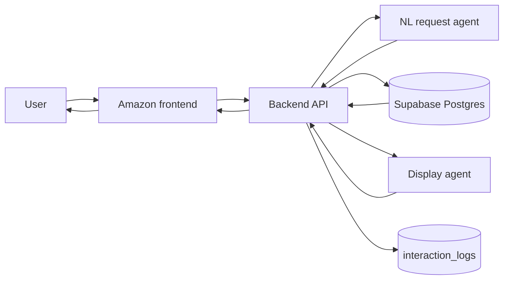
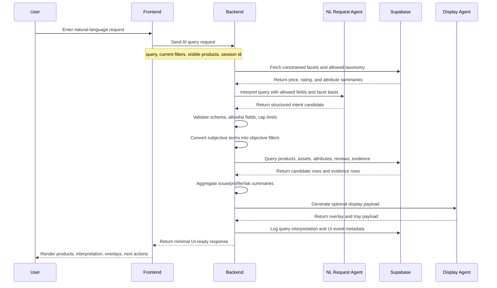
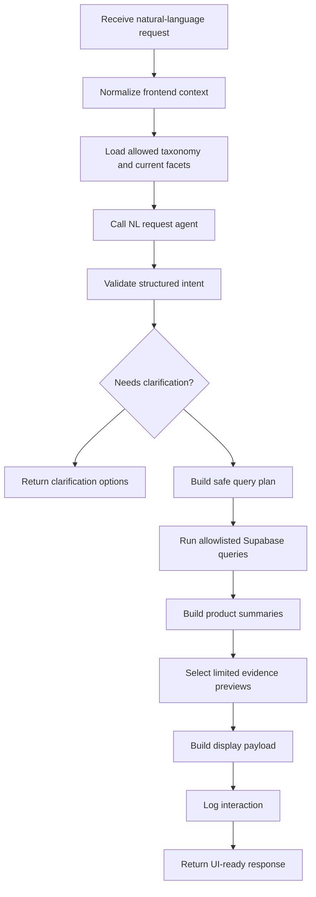
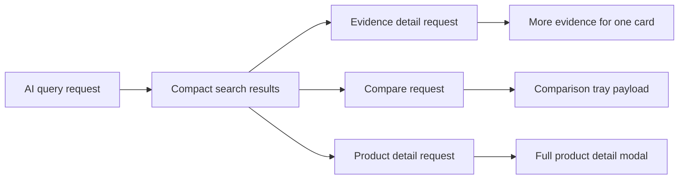

# Service Data Flow

This document defines the target service flow for AI-assisted product search and comparison. It is the shared contract between frontend, backend, and AI development.

The key idea is simple: users can speak in natural language, but the system must not treat natural language as a trusted database query. Natural language is converted into a validated query plan, and only backend-owned, allowlisted query builders can access Supabase.

## Core Principles

- The frontend never calls an LLM API directly.
- The frontend never receives or stores LLM API keys, Supabase credentials, or internal query plans.
- The LLM never writes SQL.
- The LLM never builds arbitrary backend endpoint URLs.
- The backend is the gatekeeper for query planning, schema validation, filtering, pagination, logging, and data minimization.
- Supabase remains the source of truth for catalog, attributes, reviews, profiles, evidence, and interaction logs.
- The frontend receives only UI-ready product data, interpretation text, limited evidence previews, and next-action options.

## Service Ownership



Flow meaning:

- Frontend sends the raw natural-language request and current UI context to backend.
- Backend sends constrained filter/taxonomy context to the NL request agent.
- Backend validates the returned intent before querying Supabase.
- Backend sends only scoped candidate data to the display agent.
- Frontend receives a compact UI-ready payload.

## Runtime Sequence



## Backend Pipeline



## Example User Scenario

User input:

```text
I am a 170cm woman looking for a warm winter coat for commuting.
I do not want it to be too expensive, and I dislike fits that make my shoulders look broad.
Also show the repeated downsides from reviews.
```

Frontend request:

```http
POST /api/ai/amazon/query
Content-Type: application/json
```

```json
{
  "query": "I am a 170cm woman looking for a warm winter coat for commuting. I do not want it to be too expensive, and I dislike fits that make my shoulders look broad. Also show the repeated downsides from reviews.",
  "demo": "amazon",
  "visibleContext": {
    "page": "products",
    "currentFilters": {},
    "visibleProductIds": [],
    "selectedProductIds": [],
    "sort": "relevance"
  },
  "session": {
    "sessionId": "study-session-001",
    "participantId": null
  }
}
```

Backend internal interpretation candidate:

```json
{
  "intent": "search_and_compare",
  "category": "outerwear",
  "subCategory": "coats",
  "constraints": [
    {
      "field": "attribute.warmthLevel",
      "operator": ">=",
      "value": 4,
      "reason": "User asked for a warm winter coat."
    },
    {
      "field": "price.amount",
      "operator": "<=",
      "value": 109.99,
      "basis": "Lower price range of matching coats."
    },
    {
      "field": "attribute.occasion",
      "operator": "=",
      "value": "work"
    }
  ],
  "profile": {
    "gender": "female",
    "heightCm": 170,
    "fitConcern": "avoid_broad_shoulders"
  },
  "requestedEvidence": [
    "negative_issues",
    "fit_reviews",
    "repeated_complaints"
  ]
}
```

This object is not trusted until the backend validates every field against known categories, subcategories, attribute definitions, enum options, numeric ranges, and request limits.

## Safe Query Planning

Subjective phrases are resolved by backend-owned rules using current candidate facets.

| User phrase | Backend interpretation basis | Example safe filter |
| --- | --- | --- |
| `not too expensive` | Lower price range among current candidate set | `priceMax = p40 price` |
| `good reviews` | Higher rating plus enough review coverage | `ratingMin = p70 rating`, `reviewCountMin = p70 reviewCount` |
| `warm` | Attribute taxonomy | `attribute.warmthLevelMin = 4` |
| `lightweight` | Candidate weight distribution | `attribute.weightGramsMax = p40 weight` |
| `not bulky shoulders` | Product attribute plus review issue evidence | prefer `shoulderStructure = natural`; penalize fit complaints |

The backend may expose the resolved interpretation to the user, but it should not expose raw facet distributions unless debug mode is explicitly enabled for development.

## Minimal Frontend Response

The AI query endpoint should return a compact, UI-ready payload.

```json
{
  "queryId": "aiq_001",
  "status": "ok",
  "interpretation": {
    "summary": "Warm, lower-priced work coats",
    "appliedRules": [
      "Outerwear > Coats",
      "Warmth: high",
      "Price: lower range of matching coats",
      "Use: work or commute"
    ],
    "warning": "Shoulder-fit guidance is based on product attributes and review evidence, not exact body prediction."
  },
  "items": [
    {
      "id": "product-uuid",
      "slug": "northvale-harbor-wool-coat-1",
      "name": "Northvale Harbor Wool Coat",
      "imageUrl": "https://loremflickr.com/600/600/coats,fashion?lock=50001",
      "price": {
        "amount": 99.99,
        "currencyCode": "USD"
      },
      "rating": 4.4,
      "reviewCount": 52,
      "match": {
        "label": "Warm commute option",
        "reasons": [
          "High warmth",
          "Work-friendly style",
          "Lower-priced among matching coats"
        ],
        "risks": [
          "Some reviewers mention weight"
        ]
      },
      "evidencePreview": [
        {
          "sentiment": "positive",
          "attributeKey": "warmthLevel",
          "text": "It kept me warm through a windy commute."
        },
        {
          "sentiment": "negative",
          "issueType": "too_heavy",
          "text": "The coat felt heavier than I wanted."
        }
      ]
    }
  ],
  "comparisonTray": {
    "items": ["product-uuid"],
    "criteria": ["warmth", "price", "fit risk", "repeated downsides"]
  },
  "actions": [
    {
      "type": "refine",
      "label": "Prioritize lighter coats",
      "command": "refine_lightweight"
    },
    {
      "type": "compare",
      "label": "Compare selected items"
    }
  ],
  "pagination": {
    "limit": 12,
    "nextCursor": 24
  }
}
```

## Data Minimization Policy

Backend may use rich internal data, but frontend responses should stay small.

| Data | Backend may use internally | Frontend default response |
| --- | --- | --- |
| Full facet distribution | Yes | No |
| Product attributes | Yes | Only display-relevant subset |
| All product reviews | Yes | No |
| Review evidence rows | Yes | 0-2 preview snippets per item |
| Reviewer profiles | Yes | Aggregated warning or summary only |
| Internal score weights | Yes | No |
| Query plan | Yes | Human-readable applied rules only |
| Debug traces | Dev only | No in study mode |

Recommended response limits:

- Search result: 12-24 products.
- Evidence preview: 0-2 snippets per product.
- Top issue/risk labels: 1-3 per product.
- Compare tray: 2-4 selected products.
- Product detail: lazy-load full details only when the user opens the modal.

## Lazy Loading Strategy



The first response should be fast and compact. Detailed evidence, full reviews, and complete product details should be requested only after user intent is clear.

Endpoint mapping:

- AI query request: `POST /api/ai/amazon/query`
- Evidence detail request: `GET /api/ai/amazon/query/:queryId/items/:productId/evidence`
- Compare request: `POST /api/ai/amazon/compare`
- Product detail request: `GET /api/demos/amazon/products/:productId`

## Endpoint Direction

The current backend already has page-data endpoints under `/api/demos/amazon/*`. AI orchestration should be added separately so the basic catalog API remains stable.

Suggested AI-facing endpoints:

```text
POST /api/ai/amazon/query
GET  /api/ai/amazon/query/:queryId/items/:productId/evidence
POST /api/ai/amazon/compare
POST /api/ai/amazon/refine
```

Existing catalog endpoints remain useful internally and externally:

```text
GET /api/demos/amazon/home
GET /api/demos/amazon/categories
GET /api/demos/amazon/products
GET /api/demos/amazon/products/facets
GET /api/demos/amazon/products/:productId
```

## Guardrails

Backend must enforce:

- Schema validation for every AI output.
- Allowlisted category, subcategory, sort, filter, and attribute keys.
- Numeric min/max validation using attribute definitions.
- Pagination and result-size caps.
- Evidence text must come from stored review evidence or review body.
- Product image URLs should come from `product_assets`, usually `primary`.
- No raw SQL generated by an LLM.
- No arbitrary endpoint or table access generated by an LLM.
- No hidden prompt/debug data in study-mode responses.
- Interaction logging for user query, interpreted rules, selected items, overlays shown, refinements, and final choice.

## Frontend Responsibilities

Frontend should:

- Collect the raw user request.
- Send current UI context: current filters, visible product IDs, selected product IDs, and session ID.
- Render the backend response without inventing new evidence.
- Show applied AI interpretation in plain language.
- Render product images from backend `imageUrl` or `assets.primary`.
- Render evidence previews close to the relevant product card.
- Let the user refine, repair, compare, or open full details.
- Never call the LLM provider directly.

## Backend Responsibilities

Backend should:

- Own `/api/ai/amazon/*` orchestration.
- Fetch facet basis before resolving subjective terms.
- Call the NL request agent with constrained context.
- Validate AI output before executing any query.
- Query Supabase through typed repository functions.
- Summarize evidence and risk from stored review/evidence data.
- Call the display agent only with scoped candidate data.
- Return compact UI-ready payloads.
- Write study/runtime logs.

## AI Agent Responsibilities

NL request agent should:

- Convert natural language into structured intent candidates.
- Use only fields provided by backend context.
- Mark ambiguous cases for clarification.
- Avoid inventing filters or unsupported attributes.

Display agent should:

- Format candidate evidence into overlay/tray payloads.
- Preserve provenance snippets.
- Include uncertainty or warning text when evidence is thin.
- Avoid deciding the user's final choice.

## Current Implementation Note

As of this document, the target service flow is not fully implemented end to end. The backend has Amazon catalog/facet/detail APIs and Supabase seed data. The `ai/` directory has separate NL and display agent prototypes. The active Amazon frontend still needs to be consolidated into one `src/` implementation and connected to backend APIs before this flow becomes the production path for the demo.
